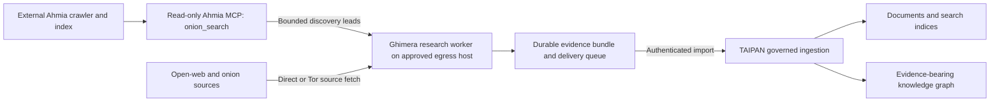

# Ahmia-backed onion discovery

Status: adapter implemented in development source; deployment pending. This is
an addition to the complete collector scope, not a substitute for its remaining
browser, document, research-quality or runtime acceptance.

## What is free and what is not supplied

Ahmia publishes its [crawler](https://github.com/ahmia/ahmia-crawler),
[index](https://github.com/ahmia/ahmia-index) and
[search site](https://github.com/ahmia/ahmia-site) under BSD-3-Clause. Software
licensing is distinct from operating costs, dependencies and rights to a corpus.
Installing those repositories does not supply the hosted service's collected
index. An operator-owned deployment needs its own permitted seed sources, Tor
connectivity, storage and index maintenance.

The public service's [terms, updated 25 September 2026](https://ahmia.fi/terms/),
require permission for scraping. This integration targets an operator-owned
Ahmia index, not an automated scraper of the hosted website. Other software's
licenses and source access/retention permissions still need their own review.

## Native composition

The first implementation is a read-only lead provider over an explicitly bound
private Ahmia Elasticsearch index. It uses the existing `GroundedSearch` final
accounting template and `DiscoveryProviders` routing, not another crawler,
frontier, research loop or model registry. A separate application tool can expose
the same lead service as `onion_search`, returning the existing MCP `data.leads`
envelope. MCP sessions and authentication remain application-owned.

The upstream [mapping pinned at d18e0222, 17 November 2025](https://github.com/ahmia/ahmia-index/blob/d18e0222fdcc18376afe878ebea676163734becc/mappings_tor.json)
defines `url`, `title`, `h1`, `meta`, `content`, `domain`, `content_type`,
`updated_on` and `is_banned`. Query original fields with bounded JSON queries;
do not submit model-generated Elasticsearch query syntax. Treat ranking scores
as retrieval scores, not calibrated probabilities. Do not assume the mapping's
English analyzers establish multilingual retrieval quality.

Only validated observed v3 onion HTTP(S) URLs enter this provider's frontier.
Record index identity/revision, native response bytes and query provenance.
Retain source observation age, exclude banned entries, and distinguish partial
or timed-out index searches from legitimate empty results. Index excerpts are
discovery context, not collected source documents. The collector separately
fetches source bytes through its existing verified Tor, scope and entitlement
boundaries before claims can cite them.

## Configuration and ownership

A typed, versioned Ahmia binding must declare the exact index/search endpoint,
approved destinations, authorization mode, index identity/revision, query fields,
age policy, response/request limits and timeout. No endpoint, credential, index,
hosted onion address or operator threshold belongs in Python constants.
Credentials are explicitly injected, omitted from recipes and logs, and never
borrowed from source sessions. TLS verification remains on; redirects and
ambient proxies must not forward private index credentials elsewhere.

Keep index control traffic separate from source Tor traffic. Endpoint and DNS
validation happen before contact. Missing configuration or client credentials
refuse before research starts. Effective non-secret recipes bind the receipt and
continuation identity, while quotas belong to the run. An index failure must not
become a false empty search or a claim of complete dark-web coverage.

`AhmiaConfig` owns the binding; `AhmiaIndexSearch` inherits the existing final
`GroundedSearch.discover` template. `PinnedJsonHttp` owns the actual bounded,
approved-destination POST and explicitly injected Bearer/API-key authentication.
The existing model transport borrows the same primitive but retains its original
model response/refusal types and recipe serialization. Source fetches do not
borrow this private service transport or its credentials.

Use [the non-active fragment](../examples/ahmia.toml) for a single `[search]`
binding, or place the same binding under a configured discovery provider whose
`domains` is exactly `["onion"]`. Authenticate a single index explicitly with
`Collector(..., ahmia_credential=secret)`; with multiple providers, use
`discovery_credentials={"provider-id": secret}`. These values are `SecretStr`
objects supplied by the application, never embedded in TOML. Missing or extra
credential bindings refuse during assembly. The plain CLI does not discover
private index credentials automatically.

An application-owned MCP server can call the same adapter, without introducing
a second search implementation:

```python
from ghimera.ahmia import AhmiaIndexSearch
from ghimera.research_types import SearchQuery, SearchRequest

search = AhmiaIndexSearch(index_config, credential=index_secret)

async def onion_search(query: str, limit: int):
    # The hosting application's validated policy supplies these budgets.
    return await search.tool_payload(SearchRequest(
        query=SearchQuery(text=query, question_ids=("discovery",)),
        limit=limit,
        max_bytes=rpc_policy.max_response_bytes,
        timeout_seconds=rpc_policy.timeout_seconds,
    ))
```

The host registers that handler and owns MCP authentication, protocol envelopes,
request admission, sessions and lifetime. The result is the existing `data.leads`
shape consumed by `McpLeadSearch`; typed `index_evidence` retains the hit ID,
operator-declared index revision, observation/retrieval times and retrieval score.
The adapter bounds its payload; the host must also bound the final MCP protocol
envelope. The declared revision is an operator assertion, not an independently
verified immutable Elasticsearch index UUID or snapshot identity.

Native archive readback re-decodes the original bounded index response and checks
that normalized hits and metadata agree. Empty results retain a retrieval time
and require a complete successful search response too. MCP metadata remains
provider-reported discovery provenance, not proof that a downstream source was
fetched or that the external server's index identity is authentic.

## Bounded implementation tracker

- [x] Inspect and pin the upstream mapping/search dialect used by the adapter.
- [x] Add the typed Ahmia binding and concrete bounded private index client.
- [x] Compose it through Collector, native research, retained discovery and
      archive/continuation readers; reuse per-provider and global accounting.
- [x] Provide an application-callable lead envelope compatible with
      `onion_search`, without implicitly deploying an MCP server.
- [ ] Exercise schema/URL validation, partial search failures, byte/time limits,
      cancellation, credential isolation and restart/resume quota preservation.
- [ ] Run the corrected complete package gate before calling the candidate green.
- [ ] Provision a pinned operator-owned index/crawler with explicit storage,
      permitted seeds and maintenance configuration; do not modify a shared
      deployment or download a corpus implicitly.
- [ ] Validate a real cold start and a stalled-branch recovery, retaining native
      documents, citations and graph output. Report index coverage and observation
      freshness, not exhaustive dark-web coverage.

Initial wire fixtures can prove bounded transport and composition, but not that
an index exists, contains relevant documents, or provides adequate language and
topic coverage. Publication and platform activation require separate evidence.

## Development verification

On 7 October 2026, the focused Ahmia/served-model/embedding/preflight/MCP/discovery
checks returned **124 passed in 59.14 seconds**, no skips reported, using
`/tmp/chimera-c0-20261006/.venv/bin/python` (Python 3.11.16) importing
`/tmp/ghimera-ahmia-20261007/src/ghimera`. Ruff and strict mypy over 113 source
files passed before that run. The fixtures make actual loopback HTTP requests
and fetch an onion-shaped source through an owned SOCKS transport, retaining
native source bytes, citation checks and complete archive readback. Search and
model responses are controlled protocol fixtures, not real Ahmia coverage or
real-model research accuracy. A subsequent Ahmia-only run returned **24 passed
in 21.09 seconds**, no skips reported, with the same interpreter and source path.
It also checks native and multi-provider Collector assembly, MCP payload
expansion against its byte cap, and archive replay rejecting forged index
metadata even after the normalized response digest is re-sealed. The complete
package gate remains pending on the current source.

The first complete Ahmia package gate returned **792 passed, 1 failed in
697.42 seconds**, no skips reported, using the same Python 3.11.16 interpreter
and owned source path above. Offline lock, Ruff/format and strict mypy passed.
The failure was an obsolete mutation-test anchor: it attempted to disable the
private DNS guard in `model_http.py` after that guard moved to `private_json.py`.
The witness is retargeted to the actual guard, not skipped or relaxed; a second
witness verifies the Ahmia client uses it too. The complete mutation module
then returned **18 passed in 45.46 seconds**, no skips reported, using the same
interpreter and source path. A fresh complete gate is still required; the failed
earlier run is not relabeled green.

## Future downstream architecture: external Ahmia MCP, governed results

Status: design only, requested by the owner. This section does not authorize
deploying an index, starting an MCP server, changing a platform service or
registering collected material. Ghimera remains an independently usable library.

For TAIPAN, keep the discovery and collection hardware separate from the platform
that stores and serves the resulting evidence:



### Separate responsibilities

- **Ahmia service:** owns its permitted seeds, crawler, Tor connectivity, index
  storage, maintenance and observation freshness. The MCP search adapter receives
  bounded queries and returns leads with index provenance; it has no authority to
  write to TAIPAN or to broaden a caller's source access. Its internal search
  endpoint is not exposed as arbitrary Elasticsearch query execution.
- **Ghimera worker:** owns the intent, discovery routing, source fetches, document
  extraction, graph proposals and retained research evidence. Fetches run on the
  approved external egress host, not on TAIPAN's broker or model-serving hosts.
  An application can borrow an authorized platform model endpoint for inference
  without giving that endpoint responsibility for external crawling.
- **TAIPAN ingestion:** authenticates the submitting identity, validates the
  import, stores the original evidence and derived outputs, and applies the
  platform's normal registration and audience controls. It does not trust an
  external MCP service's identity claims or grant itself broader access merely
  because a URL or document was returned by a spider.

Only the application owns the MCP session and credentials. Discovery credentials,
source sessions and downstream import credentials are distinct bindings. The
index does not receive a TAIPAN write credential. Tool descriptions and retrieved
content are untrusted data, not instructions or authorization.

### Proposed handoff contract

Define a typed, versioned evidence-bundle manifest at the future integration
boundary, rather than adding TAIPAN imports to the core collector. It should bind:

- producer/run identity, schema version, original intent and effective non-secret
  recipe digest;
- source URL, fetch time, content digest, media type and original retained bytes
  or an explicitly admitted content-addressed pointer;
- discovery query, provider/index identity, index observation time and retained
  native response digest, kept distinct from source-fetch provenance;
- extracted text and document/page/span locators; claims cite these locators and
  source documents, never a search snippet alone;
- proposed entity/edge identifiers, relation type, supporting spans, extractor
  and model versions, and explicit distinction between observation and inference;
- handling, retention and source-access metadata, plus unresolved gaps and
  refusal records. A declared handling label remains subject to ingestion checks.

Use a durable local delivery queue so collection can proceed during a downstream
outage, subject to configured storage headroom and retention. Each bundle has a
stable idempotency identity; retries must not duplicate documents or graph edges.
Ingestion acknowledges accepted digests and returns platform record identifiers.
Keep local evidence until that acknowledgement and the configured durability
check succeed. Quarantined or refused imports remain explicit, not silently
counted as published. Delivery is independently bounded and observable; it does
not require running another crawl to retry an upload.

The exact platform API, authentication audience, object-store destination,
identifier mapping and graph vocabulary must be resolved against the deployed
platform contracts when implementation is authorized. Do not invent an endpoint
or let the external worker directly mutate graph-store tables.

### Configuration and future acceptance

Configure MCP endpoint/authentication, permitted egress hosts, Direct/Tor routing,
provider budgets, index-age policy, storage/delivery limits and downstream mapping
as operator inputs. Native index scores remain retrieval scores, not calibrated
identity probabilities or facts about a source. Index coverage is explicitly
bounded; an empty or stale index cannot establish that no relevant sites exist.

Before activation, demonstrate one intent through real discovery, source fetch,
retained document and cited graph proposal, then governed ingestion and analyst
readback. Also demonstrate downstream outage/retry without duplication, refused
imports without publication, a changed source with preserved prior evidence,
and an index outage without false completeness. The standalone adapter's fixture
gate and the downstream deployment acceptance are separate milestones.
