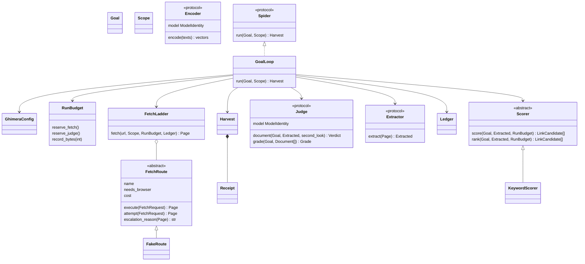

# Chimera C0 — package footing

This records the initial C0 footing; the lane tracker below describes current
development source. Later source additions and real-world acceptance are
separate, and an implementation or source gate is not a deployment claim.

## Product and scope

C0 of TAIPAN's `plan/roadmap-050/PRD-chimera-spider.md`, read at `c0b5952d`.
The owner confirmed separate-repository development, laptop testing and local
models first. Donor: go-spider `6a06245`; its local edits remain untouched.
No real-crawl accuracy, throughput or live egress acceptance follows from C0.

## Exact class structure

`Encoder` began as the C3 port shown here. Current source includes
`SelfHostedEncoder` and `EmbeddingScorer`; their implementation does not prove
real-model retrieval quality. All doubles are clearly offline fixtures, never
production fallbacks.

## Contracts and ownership

- `chimera.config/1`: frozen Pydantic; rejects unknown fields and newer versions.
  Operational budgets, thresholds and politeness values are explicit TOML inputs,
  validated before work and recorded as effective non-secret config. It requests
  `crawl_egress`, not a named node or card. Broker leases stay outside this package.
- `Goal`, `Scope`, `Page`, `Extracted`, `LinkCandidate`, `Verdict`, `Grade`,
  `Document`, `LedgerRow`, `ModelIdentity`, `Receipt`: immutable validated objects.
  Original bytes and native-language text stay separate; JSON bytes use base64;
  probabilities reject NaN/infinity. Judge identity/revision is in the receipt.
- `chimera.harvest/1`: package reader/writer together (`model_validate_json`,
  `model_dump_json`), fetch/byte/judge/accepted counts reconciled to the contiguous
  ledger. TAIPAN's frozen `taipan.harvest/1` conversion belongs to C4.
- `Ledger`: append-only, owned per run; immutable snapshots. Configured per-run
  JSONL observations and completion summaries persist before acknowledgment;
  interruption replay remains unsealed. Unreleased source includes a separate
  completed-round continuation owner and a versioned resumable command; later
  uncheckpointed external calls refuse blind replay. See RUN_JOURNAL.md,
  CONTINUATION.md and COMMAND_CONTINUATION.md.
- `RunBudget`: reserves before each route/model call. Escalations also spend
  budget; async calls have timeouts. C1 must bound reads to the byte allowance and
  check DNS/redirect destinations before I/O. Overruns record actual bytes and
  refuse, never falsify a compliant receipt.
- `FetchRoute.execute`, `FetchLadder.fetch`, `Scorer.score`: final templates,
  enforced at subclass creation; identity/cost declarations and immutable reference
  tables. Only actual extension hooks can vary; common ordering cannot be overridden.
- `GoalLoop`: priority frontier, visited state per run, SHA-256 duplicate accounting,
  second model pass on hold, saturation/grade/budget stops. Refusals never become
  fabricated answers or an implicit alternate model.
- C0 exact-host/depth scope is narrower than C3's planned audited one-hop exception.
  Private resolved-IP/rebinding checks, canonical/near-dedup handling and streaming
  persistence remain explicit subsequent work.

## Local models first

`model_policy = "self_hosted_only"` is explicit; an external judge refuses before
work. Fixture identities say `test_double`, not invented governed ids. C3/C4 bind
existing platform served models and exact revisions. A local API does not mean
an external model. No external fallback, inference stack, endpoint or secret ships.

## Lane tracker and bounded close plan

| Lane | Source | Remaining acceptance |
|---|---|---|
| C0 | Models/config/ports/bases/loop/doubles/tests implemented | Full package gate, wheel/import evidence and review; no live activation |
| C1 | Direct/Tor HTTP, robots, guarded DNS/redirects and per-host queues; isolated Patchright DOM rendering with parent-fetched resources and verified per-hop browser redirects; explicitly authorized source cookie/header sessions; configurable FlareSolverr/Byparr local-gateway clients and concurrent origin-scoped clearance reuse implemented | Deployed real gateway and remote challenge acceptance, same-browser/human-assisted handling, alternate passive browser drivers, public browser/Tor, real entitled-publisher and full publisher acceptance remain. Byparr 2.x exposes a separately deployed Camoufox gateway, not a passive-renderer replacement; see C1.md/TOR.md/C1_BROWSER.md/SOURCE_SESSIONS.md/CHALLENGES.md |
| C2 | Native HTML/Markdown, adaptive profiles with persistent drift/doctor, configured one-shot generic reparse with attempt/ledger provenance, metadata/language ID, real Docling DOCX/native PDF and configured offline model-based PDF tables/OCR/column order, canonical/SimHash dedup with retained occurrences and within-run content drift implemented | Representative PDF/non-English OCR quality, Marker and archived-publisher-pair/false-merge acceptance; see C2_HTML.md/C2_DOCUMENTS.md/C2_DEDUP.md |
| C3 | Graph, intent loop, SearXNG, self-hosted completion/embedding ports, bounded evidence context, native pinned-shelf or budgeted original-intent vector scoring, configurable document-reference/citing-source frontier, configuration-driven concrete Collector assembly and an explicit intent command with complete private result archive implemented. Unreleased source adds native semantic extraction, graph-aware planning, identity/dispute research questions, explicit complete batched review with per-call provenance, opt-in assigned-role review questions and completed-round continuation through library/command | Admitted real-model quality, calibrated judge band, representative reference adequacy, actual alias/temporal identity decisions and interrupted-call reconciliation remain; see COLLECTOR.md/COLLECTOR_COMMAND.md/C3_RESEARCH.md/SEMANTIC_EXTRACTION.md/SEMANTIC_BATCHING.md/GRAPH_PLANNING.md/IDENTITY_PLANNING.md/CONTINUATION.md/COMMAND_CONTINUATION.md |
| C4 | Not implemented | TAIPAN shelf compiler, broker placement, harvest reader/registrar, transfer, spend, SDK/MCP/doctor; register inert, never approve |
| C5 | Not implemented | Sibling edge env/browser recipe, public-IP assertion, live corpus and measured acceptance |
| C6 | Not implemented | Autoscaled concurrent pool and additional approved egress nodes |

Pydantic is the only C0 runtime dependency, exactly pinned and locked with
transitives; dev tools have a separate locked group. C1/C2 verify and add real
libraries to runtime dependencies and the edge recipe when importing them. No
dummy dependency or PRD performance claim is passed off as validated. The full
package gate applies here; no separate TAIPAN full-suite claim is made.

## Executable acceptance

Tests first: collection initially failed because `chimera` did not yet exist.
Tests exercise budget/saturation/grade stops, immutable models, scope, terminal
challenge/login/paywall/robots refusals, hold, isolation and receipt reconciliation.
Base conformance is parameterized across C0 members and alternate fixture subtypes.
Isolated mutation subprocesses disable final/scope/reservation/refusal/candidate/
sorting guards and require behavioral tests to go red. Core import/AST checks
forbid inference/platform stacks and type suppression. Exact interpreter, gate
and build results are recorded in `docs/C0_EVIDENCE.md` after completion.

## Assumptions and open decisions

1. The independent repository's configured origin is
   `https://github.com/ginkorea/ghimera`. Standalone source/publication and platform
   integration/deployment remain separate deliverables.
2. The initial C0 policy had no robots override. Current source has an explicit
   recorded exact-host override; it does not authorize login/paywall bypass or
   silently enable challenge recovery. See C1.md and CHALLENGES.md.
3. nodriver remains optional and off, not a C0 dependency.
4. Laptop testing is owner-approved, not permission for government-cloud production
   egress, login/paywall bypass or credential disclosure. The subsequent owner
   request adds configurable local challenge recovery; see CHALLENGES.md for
   its implemented boundary and remaining real-provider acceptance.
5. Donor README declared MIT but its referenced licence file was missing. The
   published go-spider 0.1.0 metadata/source archive confirms `license = "MIT"`;
   the 0.2.0 release restores the MIT text and owner attribution. Historical
   candidate evidence still records the missing-file state at its own revision.
6. Removed prototype source/bytecode remains in Git history. Original local edits
   and production data are untouched; no backwards-compatible CLI is claimed.
