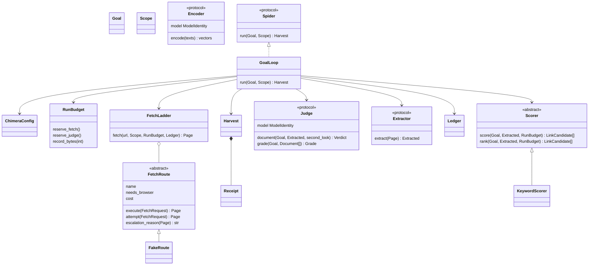

# Chimera C0 — package footing

Status: source candidate, not published or deployed.

## Product and scope

C0 of TAIPAN's `plan/roadmap-050/PRD-chimera-spider.md`, read at `c0b5952d`.
The owner confirmed separate-repository development, laptop testing and local
models first. Donor: go-spider `6a06245`; its local edits remain untouched.
No real-crawl accuracy, throughput or live egress acceptance follows from C0.

## Exact class structure

`Encoder` is a port for C3, not an implemented embedding adapter. All doubles
are clearly offline fixtures, never production fallbacks.

## Contracts and ownership

- `chimera.config/1`: frozen Pydantic; rejects unknown fields and newer versions.
  Operational budgets, thresholds and politeness values are explicit TOML inputs,
  validated before work and recorded as effective non-secret config. It requests
  `crawl_egress`, not a named node or card. Broker leases stay outside this package.
- `Goal`, `Scope`, `Page`, `Extracted`, `LinkCandidate`, `Verdict`, `Grade`,
  `Document`, `LedgerRow`, `ModelIdentity`, `Receipt`: immutable validated objects.
  Original bytes and native-language text stay separate; JSON bytes use base64;
  probabilities reject NaN/infinity. Judge identity/revision is in the receipt.
- `chimera.harvest/1`: package reader/writer together (`model_validate_json`,
  `model_dump_json`), fetch/byte/judge/accepted counts reconciled to the contiguous
  ledger. TAIPAN's frozen `taipan.harvest/1` conversion belongs to C4.
- `Ledger`: append-only, owned per run; immutable snapshots. JSONL persistence
  and checkpoint recovery are later adapters, not claimed implemented.
- `RunBudget`: reserves before each route/model call. Escalations also spend
  budget; async calls have timeouts. C1 must bound reads to the byte allowance and
  check DNS/redirect destinations before I/O. Overruns record actual bytes and
  refuse, never falsify a compliant receipt.
- `FetchRoute.execute`, `FetchLadder.fetch`, `Scorer.score`: final templates,
  enforced at subclass creation; identity/cost declarations and immutable reference
  tables. Only actual extension hooks can vary; common ordering cannot be overridden.
- `GoalLoop`: priority frontier, visited state per run, SHA-256 duplicate accounting,
  second model pass on hold, saturation/grade/budget stops. Refusals never become
  fabricated answers or an implicit alternate model.
- C0 exact-host/depth scope is narrower than C3's planned audited one-hop exception.
  Private resolved-IP/rebinding checks, canonical/near-dedup handling and streaming
  persistence remain explicit subsequent work.

## Local models first

`model_policy = "self_hosted_only"` is explicit; an external judge refuses before
work. Fixture identities say `test_double`, not invented governed ids. C3/C4 bind
existing platform served models and exact revisions. A local API does not mean
an external model. No external fallback, inference stack, endpoint or secret ships.

## Lane tracker and bounded close plan

| Lane | Source | Remaining acceptance |
|---|---|---|
| C0 | Models/config/ports/bases/loop/doubles/tests implemented | Full package gate, wheel/import evidence and review; no live activation |
| C1 | Direct/Tor HTTP, robots, guarded DNS/redirects and per-host queues implemented | Browser ladder, controlled onion and full network acceptance remain; see C1.md/TOR.md |
| C2 | Not implemented | Pinned extraction libraries, adaptive profiles, language ID, tables, canonical/near-dedup, archived-pair acceptance |
| C3 | Configurable graph, shared-session intent loop and SearXNG adapter implemented | Concrete served models, context selection, encoder/scoring, one-hop expansion and real research acceptance remain; see C3_RESEARCH.md |
| C4 | Not implemented | TAIPAN shelf compiler, broker placement, harvest reader/registrar, transfer, spend, SDK/MCP/doctor; register inert, never approve |
| C5 | Not implemented | Sibling edge env/browser recipe, public-IP assertion, live corpus and measured acceptance |
| C6 | Not implemented | Autoscaled concurrent pool and additional approved egress nodes |

Pydantic is the only C0 runtime dependency, exactly pinned and locked with
transitives; dev tools have a separate locked group. C1/C2 verify and add real
libraries to runtime dependencies and the edge recipe when importing them. No
dummy dependency or PRD performance claim is passed off as validated. The full
package gate applies here; no separate TAIPAN full-suite claim is made.

## Executable acceptance

Tests first: collection initially failed because `chimera` did not yet exist.
Tests exercise budget/saturation/grade stops, immutable models, scope, terminal
challenge/login/paywall/robots refusals, hold, isolation and receipt reconciliation.
Base conformance is parameterized across C0 members and alternate fixture subtypes.
Isolated mutation subprocesses disable final/scope/reservation/refusal/candidate/
sorting guards and require behavioral tests to go red. Core import/AST checks
forbid inference/platform stacks and type suppression. Exact interpreter, gate
and build results are recorded in `docs/C0_EVIDENCE.md` after completion.

## Assumptions and open decisions

1. g39 hosting is the working assumption; no remote migration or publication done.
2. Robots override can only be a recorded per-shelf decision, if allowed. C0 has
   no override switch; C1/C4 must represent the policy before permitting it.
3. nodriver remains optional and off, not a C0 dependency.
4. Laptop testing is owner-approved, not permission for government-cloud production
   egress, CAPTCHA solving, login/paywall bypass or credential disclosure.
5. Donor README declared MIT but its referenced licence file is missing. Preserve
   that provenance and verify terms before public package publication.
6. Removed prototype source/bytecode remains in Git history. Original local edits
   and production data are untouched; no backwards-compatible CLI is claimed.
