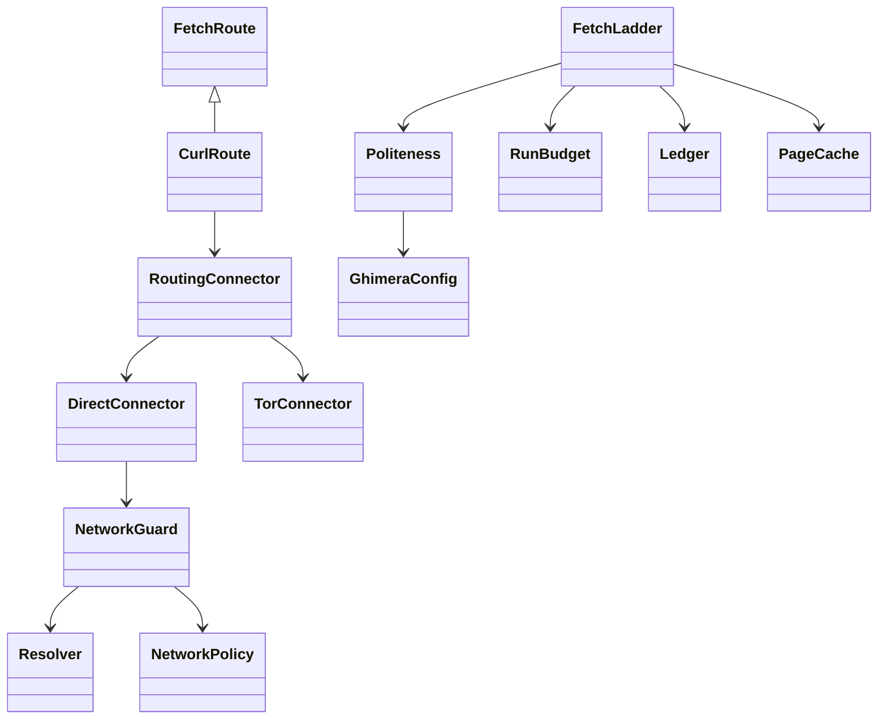

# C1 — real fetching and safe network boundary

Status: real HTTP implemented; browser ladder remains in progress. Not activated.

Native Tor HTTP (onions and Tor-routed ordinary hosts) is now an additive C1
capability. Routing is configuration, not another provider-specific spider.
See `TOR.md` for the enforcement path, actual evidence and unfinished boundaries.

PRD: TAIPAN `plan/roadmap-050/PRD-chimera-spider.md`, C1, F1/F10.
The owner clarified the product entry point: an intent triggers grounded source
discovery, document collection, gap-driven follow-up and an evidence-cited answer.
That discovery loop will precede/extend GoalLoop; supplied URLs are optional seeds,
not a prerequisite. Search providers are configurable ports, not a dependency on
Google or a model's invented URLs. Completion must distinguish answered from
budget-limited or unresolved questions. The C3 research loop and SearXNG HTTP
adapter now implement this orchestration boundary; see `C3_RESEARCH.md` for
the actual candidate and its remaining served-model acceptance.
The owner also requires a graph from intent creation onward. A versioned graph
profile controls enablement, node/edge vocabulary, endpoint constraints, grounded
extraction, identity and sink/checkpoint policy. The package emits neutral research
records; TAIPAN's adapter projects its exact information-graph schema and keeps
intent/query/discovery trace separate from evidence-supported semantic edges.
This requirement is recorded in the TAIPAN PRD's new §4a; it is not implemented
by this HTTP candidate and remains required C2–C5 work, not optional C6 scaling.

## Network contract

All search/crawl traffic originates on the laptop or Edge. TAIPAN infrastructure
may serve the judge/encoder, never originate crawl requests. No external LLM
fallback. C4/C5 must enforce placement and record egress evidence.

The HTTP route performs one bounded GET. The final ladder owns robots, retry,
redirect, cache and ledger ordering. Every actual request, including robots,
redirects and retries, reserves page/byte/time allowance and produces a fetch row.
HTTP errors do not silently spend outside the receipt. Responses use a bounded
decoded-body callback, never an unbounded streaming queue. Headers are allowlisted
metadata; authorization/cookies are never supplied or copied across requests.

DNS is resolved, checked and pinned before each request. The public mode rejects
non-global and mixed DNS answers, IP-literal URLs, userinfo, proxy inheritance and
off-scope redirects. A separately declared fixture mode permits only explicitly
listed loopback addresses/ports, for local fake-server tests. It is not a public
mode exception or an implicit environment toggle. TLS verification stays on.

Robots failures are fail-closed except an actual missing robots file. A robots
denial, login or paywall never escalates or retries. Challenges are terminal by
default; the separately declared local gateway can recover approved public
origins, then refetch and recheck the source (see `CHALLENGES.md`). HTTP 4xx never
enter the ordinary transient retry loop. Retry count, jitter/backoff, redirect limit and response size are typed
configuration. Robots policy is explicitly `honor` or `recorded_override`; the
latter requires an exact-host decision ID, actor and reason. `Politeness.permits`
is the enforcement point, and each override lands in the ledger before fetching.
Other hosts still honor robots. Robots overrides do not enable challenge
recovery or disable login/paywall refusal. Protego performs wildcard/longest-match/group parsing; site crawl-delay
and request-rate may tighten, never loosen, the configured request spacing.
Per-host concurrency and delay, global concurrency and rate are
shared by every request. Conditional responses reuse only an exact validated
prior representation. Cache state belongs to one ladder, not a global registry.
Routes refuse a mismatched run configuration, so fixture networking and a prior
robots override cannot silently leak into a public run. Byte accounting counts
decoded content retained by callbacks (including failed transfers), not TLS or
HTTP framing. A kernel/libcurl receive buffer may prefetch wire bytes beyond the
retained-content allowance; no claim of a physical network byte cap is made.

## Class structure

## Bounded plan and tests first

1. Add typed network/HTTP policies, byte reservations and response metadata.
2. Implement the real curl route plus final ladder request accounting.
3. Exercise a real local HTTP server: plain/redirect/private DNS/challenge/403/
   robots denial/5xx retry/oversize/conditional/concurrent/delayed responses.
4. Add browser routes through the same security and cost-accounting boundary;
   browser launch and JS-page acceptance are still required C1 work.
5. Full package gate and exact interpreter evidence; public crawl acceptance later.

curl_cffi 0.16.3 is pinned from public PyPI metadata checked on the laptop. Its
documented callback and curl options are verified against installed code before
implementation. Scrapling/Crawl4AI/browser/PDF libraries remain C1/C2 work; no
claim of complete ladder or extraction follows from the HTTP tests.
