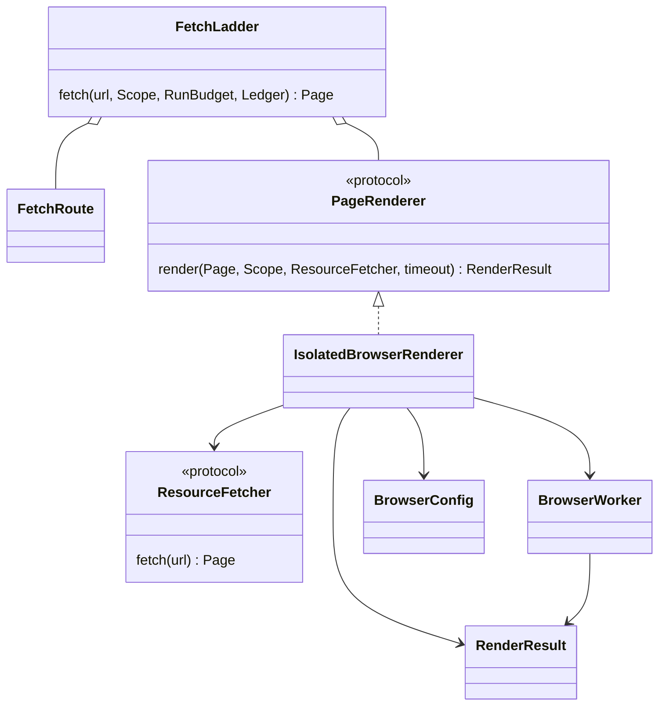

# Isolated browser rendering

Status: standalone source candidate, not a deployed or complete C1 browser ladder.
Measured source/wheel checks are recorded in [browser evidence](C1_BROWSER_EVIDENCE.md).

`FetchLadder` composes a `PageRenderer` with the ordinary `FetchRoute` providers.
The Patchright renderer is injected explicitly; a configured browser without
its bound implementation refuses. Cheap HTTP remains first. A named
`javascript_required` outcome triggers rendering only after the initial source
request's reservation is released. Challenges, robots, login and paywall refusals
remain terminal; rendered HTML is inspected for newly created barriers too.



## Policy and transport ownership

`chimera.browser/1` is frozen, rejects unknown fields, and records an effective
digest. Executable path/hash, isolation program, host scratch location, namespace
scratch mount, deadlines, concurrency, readiness selector, resource types/MIMEs,
resource/protocol/diagnostic/DOM limits and viewport are operator inputs. The
example is deliberately inert until a provisioned executable hash is supplied.
It never installs a browser or borrows a personal profile implicitly.

Python driver, Node driver and Chromium run inside a separate Linux network/PID
namespace, launched by the configured bubblewrap executable. Readback records
distinct parent and child network namespace identities. Namespace failure never
falls back to a host-network browser. The browser has a fresh nonpersistent
context; no ambient credentials, proxy variables, cookies or user profile are
imported. The driver receives only explicit non-secret process settings.

The initial HTML is locally fulfilled from retained bytes, without another GET.
Every routed script/XHR/fetch/font/style request is sent over bounded JSON-lines
IPC to the parent. The parent checks method, resource kind and the **same exact
host/port scope** before requesting it through the same ladder, run budget,
conditional cache, robots checks and global/per-host politeness. Resource MIME
types are configured separately from document MIME types; they do not widen the
allowed hosts. Transport evidence is retained for each successful resource.
Tor and native onion requests therefore use the existing connector; Chromium
does not own or configure a direct/Tor network socket.

POST, WebSocket, child-document/popup/navigation and undeclared resource requests
are refused; no GET substitution or challenge solving. Service workers are
blocked. WebSocket construction is explicitly denied, reported through a private
intercepted control route that is **never fetched**, and also covered by the
network namespace. Original CSP/CORS response headers are preserved; cookies
and decoded-body framing/compression headers are not replayed.

Followed subsidiary redirects currently refuse rather than replaying a final
200 under a false browser origin. Hop-by-hop browser redirect fulfilment remains
an explicit completion item. No claims of arbitrary authenticated web-app or
interactive-browser compatibility follow from this adapter.

## Evidence and lifecycle

`Page.body` and `Document.raw` remain original response bytes. `RenderResult`
retains DOM bytes/digest, original URL/digest, executable/driver/config identity,
network namespace readback and each successful resource's original bytes/hash,
headers and transport (or its named refusal). HTML extraction consumes the DOM
when present, records its digest and still cites original response identity.
Document/harvest readers reject mismatched raw, DOM, extraction and config
bindings. Render events spend wall time, not invented network bytes; HTTP resource
requests spend the same page/byte budgets as all other requests.

Worker concurrency, IPC and diagnostics are bounded. Timeout/cancellation reaps
the owned process session and namespace descendants, then removes exactly its
private mkdtemp scratch. It never kills a shared browser or touches host caches.
The short configurable `/run` mount avoids Chromium's Unix socket path limit
without putting host scratch on a different disk.

The root filesystem is mounted read-only with an owned writable scratch; this
is **not** a complete filesystem allowlist or a claim of resistance to a browser
exploit. Hardened filesystem/artifact admission belongs to the remaining C5
lifecycle acceptance.

## What is not closed

Camoufox/nodriver fallback, public Tor browser corpus acceptance, hop-by-hop
subsidiary redirects, publisher readiness policies and the 30-publisher C1
acceptance corpus remain open. The native Docling full-PDF/Marker recipes,
real-model/scorer acceptance and governed TAIPAN integration are unchanged open
requirements. Passing controlled browser tests does not complete the spider.

Run the full source gate with explicitly provisioned browser inputs:

```bash
CHIMERA_TEST_BROWSER=/absolute/path/to/pinned/chrome \
CHIMERA_TEST_ISOLATOR=/absolute/path/to/bwrap \
CHIMERA_GATE_CACHE=/absolute/path/to/owned/uv-cache bash scripts/gate.sh
```

The tests require these values; they do not silently skip browser acceptance or
download artifacts. The optional `browser` extra pins Patchright 1.63.0. Current
controlled tests cover JavaScript, HTTP resource accounting, direct and
ordinary-host/v3-onion SOCKS routing, denied resources, CSP, source/DOM/harvest
binding, JS-created login, resource limits, timeout and cancellation cleanup.
