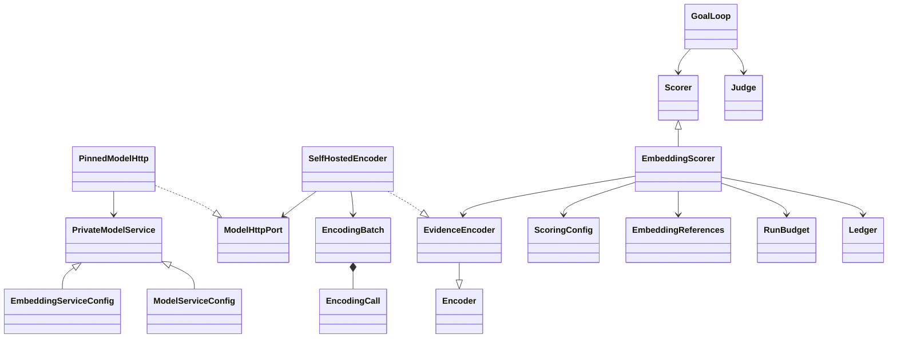

# Native embedding relevance and frontier scoring

Status: standalone source candidate. Uses an explicitly configured, self-hosted
embedding endpoint; no weight download, inference-server lifecycle, external
LLM service, translator or hidden credential discovery. HTTP fixtures establish
protocol behavior, not retrieval accuracy or admitted production model identity.

## Policy and class structure



`chimera.scoring/1` is the main configuration's `scoring` block. It owns the
encoder policy, reference-bundle hash, call/character budgets, window size and
overlap, reference/window/link limits, anchor allowance and keyword weight.
`examples/scoring.toml` is a non-routable schema example with explicit artificial
reference vectors; it must not be used as evidence or production vectors.

`chimera.embedding-service/1` declares the exact `/embeddings` endpoint, approved
private addresses, authorization/TLS policy, declared model/revision and served
name, dimensions, batching/input/output limits, optional dimension request and
native-text prefix. The prefix accommodates a model's configured input recipe;
it is part of reference compatibility, not a rewrite of retained native text.
The shared `PrivateModelService` owns network policy for both completion and
embedding endpoints. Its two subclasses enforce different endpoint paths and
task-specific fields; chat generation parameters never enter an embedding call.

An `EmbeddingReferences` bundle supplies shelf chunk vectors, source IDs and
native-text hashes. Its model/revision, dimensions and prefix must exactly match
the encoder. Its immutable serialization digest must equal the configured
reference digest. The bundle is supplied by the caller, not discovered from a
filesystem or model name. The governed shelf compiler remains a C4 deliverable.

### Intent references (unreleased source)

Standalone intent-only collection can explicitly set `reference_source = "intent"`
and omit `references_sha256`. See `examples/intent-scoring.toml`. Construct
`EmbeddingScorer(config.scoring, encoder)` without a reference bundle. The original
intent—not a model's reformulation or a search snippet—is encoded on the first
scored document. Empty collection performs no reference call. Oversized intents
refuse rather than silently clipping them. The configured encoder prefix applies
to both intent and source windows; select a compatible model input recipe.

The reference call reserves the same encoding call/character budget and run
deadline as source scoring. Its successful `encoding` ledger row precedes a
`chimera.intent-reference/1` observation containing the goal hash, model-bound
vectors and exact call sequence. Failed/cancelled calls keep their spend but
produce no prepared reference and no keyword or fabricated-vector fallback.
Later documents and research rounds reuse that run's reference. Concurrent scores
share one preparation lock; another run, intent or ledger cannot borrow it.
The cache is weakly keyed by the run budget, not a process-global registry.

Harvest and journal readers check the original goal, configured service, prefixed
input hashes/character count, prior successful call, vector identity/dimensions,
reference digest and winning window reference. They refuse absent, reordered,
duplicate or re-bound preparation. Similarity remains cosine, not calibrated
confidence. Vectors are client-recorded observations bound to a response hash;
without the raw model response these records are not independent replay of every
response byte or remote revision attestation.

The existing pinned mode stays the default and still requires its exact supplied
bundle. Its prior serialization excludes the new default field, preserving
published configuration identities. Intent mode explicitly forbids a pinned
digest or injected reference bundle; the two modes cannot be silently mixed.

Construct explicitly after parsing the main config and admitted references:

```python
from chimera.embedding import SelfHostedEncoder
from chimera.semantic_scoring import EmbeddingScorer

if config.scoring is None:
    raise ValueError("this deployment requires semantic scoring configuration")
encoder = SelfHostedEncoder(config.scoring.encoder, credential=approved_credential)
scorer = EmbeddingScorer(config.scoring, encoder, references)
# Inject scorer into GoalLoop, alongside the existing fetcher, extractor and judge.
```

Credentials are separately supplied in memory. Policy parsing does not grant
permission to send them. A configured scorer cannot silently be replaced with
the keyword-only implementation: constructor validation refuses that mismatch.

## Protocol, budgets and evidence

The adapter uses the compatible `model`, `input`, `encoding_format="float"`
request with optional `dimensions`. It validates returned model name, every
input index exactly once, configured vector dimensions, finite nonzero vectors,
and required reconciled prompt/total usage. Returned entries are ordered by
their index, not server arrival order. The wire envelope is documented in the
[vLLM embedding protocol](https://docs.vllm.ai/en/v0.12.0/api/vllm/entrypoints/pooling/embed/protocol/).

The same bounded private POST transport used by served research models enforces
approved DNS answers, pinned addresses, no inherited proxy/netrc, no redirects,
TLS verification and bounded headers/responses. There is no alternative model
or keyword fallback on encoder failure. A revision in compatible API policy is
declared, not attested: governed model admission must prove the deployed binding.

`EvidenceEncoder.encode_batch` returns immutable vectors and client-authored
call evidence. `Encoder.encode` remains available as the narrower compatibility
port. Run-owned scoring always uses the audited batch port and reserves each
batch's call and prefixed character allowance before I/O. Encoding reservations
are separate from judge and source-byte budgets but share the run deadline.
No embeddings are billed as generated text or silently counted as judge calls.

`chimera.encoding-call/1` records effective service policy, request/response and
ordered input hashes, prefixed input characters, bounded response bytes/status,
latency, available usage and success/refusal/cancellation. If an injected adapter
fails before supplying trustworthy evidence, `telemetry="unavailable"` explicitly
marks response/usage as unknown; empty hashes then are sentinels, not a claim of
an observed zero-byte server response. Failed and cancelled attempts remain in
the shared ledger. Harvest readback reconciles calls and characters to the
receipt and configured limits. No credential appears in evidence.

## Scoring behavior

1. Select bounded native character windows. Keyword-bearing windows outrank
   other windows; ties retain earlier native spans. Record exact offsets/hashes
   and union coverage/omissions. The scorer does not translate text or claim to
   have embedded omitted portions. Character limits are not token limits.
2. Prioritize observed links by URL/anchor keywords; embed only the configured
   maximum. Encode native windows and observed URL/anchor text in bounded batches.
   Long anchors are explicitly clipped with omitted-character counts. No text
   behind an unfetched link is invented.
3. Compare each vector to supplied shelf reference vectors, or the run's explicit
   intent reference, using cosine. Scale before normalization to avoid overflow.
   Each window records its winning
   reference source and text hash. Document similarity is the maximum selected
   native-window cosine, not an average of the whole document.
4. Link frontier weight is `keyword_weight * keyword_presence +
   (1-keyword_weight) * max(0, cosine)`. Retain raw cosine, keyword and final
   weight separately. This is **not a relevance probability**. The final scorer
   template validates original candidate identity/anchor, finite bounded scores,
   deadline and descending order.

The native similarity observation binds the original intent and reference
bundle. Receipt readback validates coverage, score formula and retained native
spans where the source document is retained. Rejected documents have hashed
observations, not retained text, so their spans cannot be reconstructed from a
harvest alone. Exact numeric cosine replay would require retaining response
vectors; the current ledger binds their response hash but does not retain all
returned vectors. Do not claim replay verification of the numerical model output.

Every collected document still receives the explicit judge's accept/reject/hold
verdict. Similarity enriches the trace and ranks the frontier; it does not author
publisher identity or skip a judge by presenting a cosine as confidence. A
calibrated judge decision band remains separate work against real shelf evidence.

## Remaining full-spider requirements

Real encoder/model admission and multilingual quality acceptance, the calibrated
keyword/embedding/judge decision policy, representative reference-expansion and
PDF/OCR quality, Marker and additional browser routes, governed shelf/harvest
integration and egress/runtime acceptance remain open. Reference expansion and
offline model-based PDF/OCR now have separate unreleased implementations and
bounded evidence; they are not closed by the scoring protocol tests. This
component is not full C0–C5 completion.
