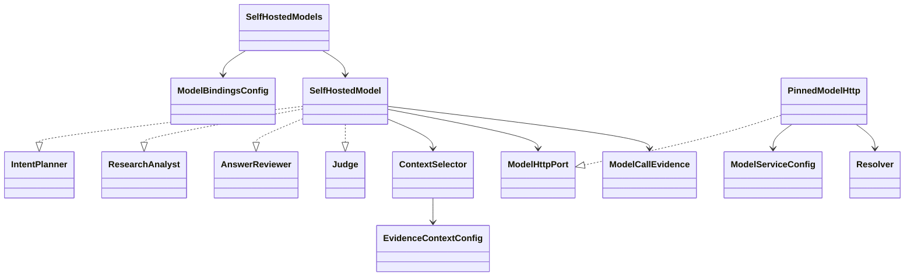

# Configured self-hosted model ports

Status: source candidate with HTTP protocol-fixture evidence and a bounded
real self-hosted-model trial over public English/Traditional Chinese documents.
See [the live-trial record](C3_REAL_MODEL_EVIDENCE.md) for successes, failures
and the acceptance boundary. No bundled model weights, inference server,
external LLM fallback or production activation.

## Owning boundaries

`chimera.model-service/1` owns the exact completion endpoint, approved private
addresses, authentication mode, declared model ID/revision, exact served-model
name, deadlines, input/output limits, generation parameters and evidence context.
`examples/model-service.toml` is an explicit, non-routable example.

`chimera.model-bindings/1` assigns service policies to planner, analyst, reviewer
and judge in the main configuration's `models` block. `SelfHostedModels.from_config`
constructs all four roles from that parsed boundary; no role/endpoint is inferred
from an environment variable or hard-coded operational choice. Required distinct
reviewer identities are checked before collection starts.

Credentials are supplied separately in memory as `SecretStr`, keyed by exact
configured endpoint. They never appear in configuration, prompts, call evidence
or a fallback request. HTTPS verifies certificates/hostnames; plain private HTTP
and credential-bearing private HTTP each require their own explicit switch.
Configuration does not itself grant permission to use a destination or token.

## Class structure

Composition is intentional: source transport and model-control transport have
different authorities. The model client does not reuse a crawl/Tor route and
cannot inherit source cookies, proxy settings or authentication.

## Protocol and refusals

`SelfHostedModel` implements planning, coverage assessment, drafting, review,
document verdicts and goal grading. The request envelope uses compatible Chat
Completions messages and either configured JSON mode or JSON Schema mode. The
typed local result validator remains mandatory in both modes.

The recommended example also sets `citation_format = "template_ids"`.
Assessment/drafting responses then select a `citation_id` from this call's
supplied evidence windows. The client resolves it to the exact retained native
quote, character bounds, source URL and digests; invented or out-of-context IDs
refuse as `unsupported_answer`. It does not repair generated quotations by
similarity. Existing configurations default to `full` for compatibility;
template-ID requests record prompt revision `chimera-research-prompts/2`.
Public assessment, draft, archive and citation types remain unchanged.

[Official OpenAI request/response envelope](https://developers.openai.com/api/reference/resources/chat/subresources/completions/methods/create)

The service's entire DNS answer must match its explicitly approved private or
loopback addresses. The selected address is pinned before POST. Public/metadata
addresses, inherited proxies/netrc, redirects and TLS-verification disabling are
not supported. Body/header callbacks enforce response limits; there is no retry
against another endpoint/model. The returned model name must match the configured
served name; one `stop` choice is required. Truncation, refusal, invalid JSON,
unexpected model identity and missing required usage are recorded failures.

The model's version is **declared configuration**, not an attested fact obtained
from this compatible HTTP envelope. Actual admitted model/revision binding remains
the TAIPAN seam's responsibility. Different declared IDs alone do not prove two
physically independent judge families; live admission/acceptance must establish it.

## Native evidence and spend

`ContextSelector` selects bounded native character windows and generates exact
citation templates bound to retained document bytes/text. Original text remains
unchanged. Required assessment/answer citations are included before discretionary
context; if they cannot fit, the phase refuses rather than omitting its support.
Every selected document reports selected/omitted characters; excluded documents
are listed. Model requests contain no raw HTML/PDF payloads.

The selector is a deterministic keyword-window baseline, not an embedding
reranker or evidence that a model saw the entire corpus. These omissions are
provided to the model, which must retain unresolved coverage when support is
missing. The prompt ceiling counts instructions/schema and user context; a
separate byte ceiling bounds the whole wire request.

A document judge's first look uses `context.window_chars`. Its explicit
second look expands that same native span, up to `context.max_chars`, without
rewriting text or losing the first excerpt. Selected bounds and omitted
characters remain observable; normal prompt/wire ceilings still apply before
I/O. A second look is not permission to send an unbounded document.

`chimera.model-call/1` records effective non-secret service policy, prompt
revision, request/response hashes, status, bounded response bytes, latency,
available reconciled token counts, selected native spans, omissions and outcome.
The client authors this telemetry; model-generated telemetry is refused. Success
and failure evidence enters the same verdict/grade/research ledger as shared run
spend. Missing usage stays unknown, never fabricated as zero. Call latency is
not claimed as GPU compute time or billing evidence.

## Acceptance

The exact candidate has a full-package gate plus actual curl POST acceptance
against an owned JSON protocol fixture. It exercises all five phases of an
intent-only collected/cited/reviewed answer, and a separate goal grade. Tests
cover rebinding, private endpoint policy, bounded responses, redirects,
truncation, wrong model, missing usage, invalid JSON, credential isolation,
prompt ceilings and required-citation priority. Three deliberate mutations
confirm identity, completion and DNS guards are executable.

The historical protocol gate did not query a real model. The subsequent live
trial exercised every model port over actually fetched documentation, including
expanded second looks and citation-ID restoration. The collection grader still
returned `satisfied=false` with an incorrect demand for a draft; same-model review
is not independent evaluation. No real search instance or semantic encoder was
queried in that trial, and it was not the complete research loop.
Native embedding/shelf frontier scoring now has its concrete binding; see
C3_EMBEDDING_SCORING.md. Real model admission/quality, extraction, additional
browser routes, calibrated scoring and
the complete C0–C5 acceptance remain required; this is not the full spider.
