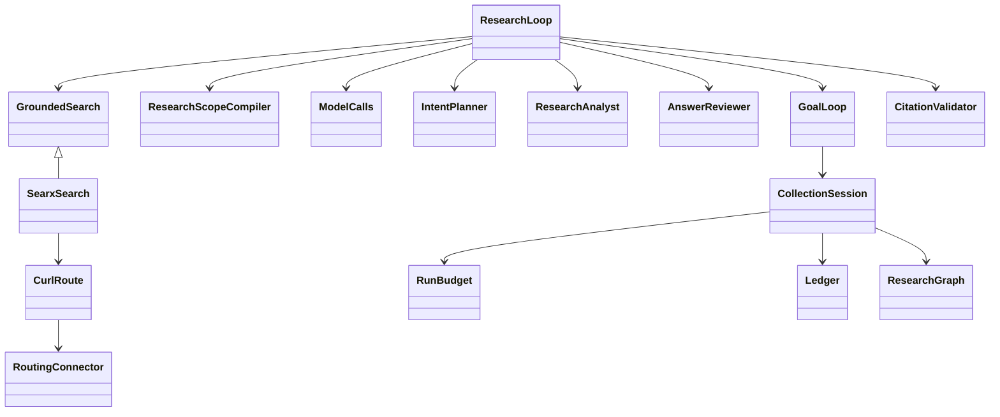

# Intent-driven research — C3 candidate

Status: orchestration, configured SearXNG JSON adapter, self-hosted model client
and bounded evidence context implemented in the standalone package. Not a
deployed service or a completed C0–C5 spider. Model behavior and remaining
admission/acceptance are detailed in `C3_MODELS.md`.

## Entry and configuration

`ResearchLoop.run(ResearchRequest(intent="…"))` accepts an intent with no seed
URLs. Owner-supplied seeds are optional hints, never a prerequisite. Inject a
`GoalLoop`, `GroundedSearch`, `IntentPlanner`, `ResearchAnalyst` and
`AnswerReviewer`; no global provider registry or hidden model launch exists.

The unreleased `Collector.from_toml` facade now assembles those concrete ports
from one effective configuration. See [configured collector](COLLECTOR.md) and
`examples/collector.toml`; intent mode needs no prebuilt reference bundle.

`examples/intent-research.toml` contains the typed `chimera.research/1` policy:
round/query/model/page limits, concurrency, answer threshold and source scope.
The harvest retains effective run configuration. `examples/searxng.toml` names
the exact configured instance; its deliberately invalid placeholder cannot
accidentally invoke a public search provider. SearXNG's JSON format must be
enabled. Its documented `/search` API supplies language, time-range and safe
search options. [SearXNG search API](https://docs.searxng.org/dev/search_api.html)

Search is not an external LLM. Source/search egress runs on the approved crawl
host; model ports must be self-hosted. `test_double` identities exist solely for
explicit offline fixtures and do not establish real model acceptance.

## Class structure and data flow

The collector opens one session before the first model/search/fetch call. The
session owns documents, visited/frontier state, graph, ledger and budgets across
all follow-up rounds. A round is a collection quantum, not a fresh run.

1. Planner decomposes the immutable intent into identified questions and queries.
   The initial question pack cannot silently change in subsequent rounds.
2. Enabled graph capture persists intent/question/query trace before discovery.
   Profile version 2 in `research-graph.toml` adds the operational vocabulary;
   discovery provenance is not an evidence-supported semantic assertion.
3. Search queries run with bounded configured concurrency. Only returned URLs,
   owner hints and links actually extracted from collected documents can enter
   collection. Public DNS/address and scope checks still apply at fetch time.
4. Collection preserves native bytes/text and shared limits. The legacy grade
   cannot terminate an intent run as answered.
   Configured reference expansion and candidate citing-source queries use that
   same session and budget; see [Sources-of-sources](C3_REFERENCES.md).
5. Analyst reports coverage with exact native-text citations. Unresolved or
   contradictory coverage triggers further discovery within the same limits.
6. A draft must cover every question. The reviewer checks the original intent
   and every claim, bound to the exact answer digest. Configured distinct-reviewer
   enforcement compares declared model identities, not merely prompt names.
7. Only a fully supported review and configured confidence floor can yield
   `answered`. Exhausted limits or remaining gaps yield `partial`; unavailable
   or invalid collaborators yield a recorded failure, not an uncited answer.

## Evidence and failure behavior

Citations bind document URL, retained raw SHA, extracted-text SHA, character
offsets and exact native quotation. The serialized result reader rechecks these
against retained documents. Search snippets are never answer citations.

`GroundedSearch.discover` is a final accounting template. Providers implement
only bounded requests. Each attempted query records provider revision, actual
query, selected transport, response digest/bytes or refusal, and latency. Search
calls charge the same fetch/byte/time budgets as collection. Model phases record
their declared identities and response digests; failures still consume a call.
The global wall deadline returns a partial result with reconciled spend.

The SearXNG adapter reuses the direct/Tor connector: TLS verification, no ambient
proxy/credentials, no redirect following, bounded decoded content and no Tor-to-
direct fallback. A strict JSON wire boundary refuses unavailable JSON output or
malformed results. The controlled SOCKS acceptance exercises real curl requests
and verifies remote resolution rather than local source DNS.

## Still required for the full spider

- Governed admission and real intent-to-reviewed-answer acceptance against served
  models. Concrete planner/analyst/reviewer/judge HTTP clients and spend records
  now exist; native shelf-vector scoring has its concrete self-hosted binding
  (C3_EMBEDDING_SCORING.md). Real model quality and calibrated decision policy
  still require acceptance.
- Bounded native-text selection now exists. Embedding-based context reranking,
  representative real-data adequacy checks and handling propagation remain.
- The configured Collector now retains its SearXNG recipe in the effective
  run configuration. Provider-response archive retention and representative
  retrieval adequacy remain separate acceptance; a digest is not a raw archive.
- Browser ladder with all-subrequest Tor enforcement, extraction/PDF adapters,
  public/onion discovery acceptance, harvest reader and TAIPAN projection/runtime.
- Complete C0–C5 acceptance against the PRD. Passing offline model doubles is
  not permission to claim a finished intent-research product.
