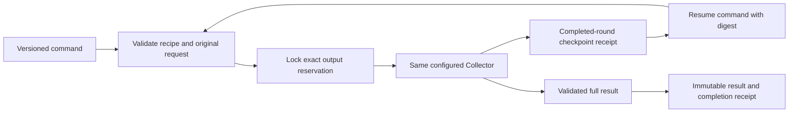

# Durable intent commands

Status: post-0.3.0 source. This connects the existing completed-round research
continuation to the concrete command, not a second collector or a model server.
The legacy `chimera.collector-command/1` command remains a one-shot invocation
with unchanged configuration serialization and immutable output behavior.

## Run, suspend, resume

Prepare an ordinary collector recipe with its existing private `[journal]` and
[continuation policy](CONTINUATION.md). Copy
[the resumable command](../examples/collector-resumable.toml), set absolute paths
on your chosen storage volume, and use a new run/output identity. Its versioned
`[execution]` block declares `operation = "run"` and optionally a positive
`suspend_after_rounds`. Omitting that count runs normally while checkpointing
completed rounds.

```bash
python -m ghimera --job /absolute/path/collector-resumable.toml --max-job-bytes 100000
```

Deliberate suspension prints a `ghimera.checkpoint-receipt/1` to stdout and exits
**3**. Preserve its `run_id` and `sha256` in your task record. It is neither a
finished archive nor an execution failure; scripts must handle that outcome
separately. If research finishes before the requested boundary, ordinary archive
receipt and exit codes apply. Zero completed rounds cannot produce a checkpoint.

Copy [the resume command](../examples/collector-resume.toml), retaining the same
recipe, run ID and output directory. Set `operation = "resume"` and
`checkpoint_sha256` to the actual receipt digest. Do **not** set `request_path`:
the pinned checkpoint owns the original intent, seeds and local-document inputs.
The original request file and already imported local seeds are not read again.

```bash
python -m ghimera --job /absolute/path/collector-resume.toml --max-job-bytes 100000
```

Optionally set another positive `suspend_after_rounds` to pause after that many
new rounds in this invocation. There is no reset of total rounds, bytes, pages,
model/encoding spend or wall time. Credentials remain explicitly supplied by the
existing binding file/environment mechanism; no source cookies or secrets are
stored in the checkpoint or output reservation.

## Ownership and ordering



The archive owner reserves a private output directory before collection. A
`0600` `reservation.json` binds run ID and exact non-secret recipe/request hashes.
It is not an answer or completion receipt. A native exclusive writer lock remains
held for the command's lifetime and is released on suspension, cancellation,
failure or completion. The original journal's separate writer lock and all
checkpoint/graph/prefix validation still apply.

Resume opens only that exact owner-private, non-symlink reservation. It never
adopts an empty directory, a one-shot command's output, another run's directory,
a sealed archive or a directory containing uncertain partial result files. It
does not rewrite metadata, remove evidence, replace a result or choose a new run
identity. Both `result.json` and the completion `receipt.json` keep the existing
no-overwrite publication contract. Ordinary archive readers remain usable.

The command validates checkpoint and output ownership before new external calls.
Missing/altered pins, recipes, graph or journal observations refuse before
planning or collection. Output limits can be explicitly adjusted, but changing
the collector recipe or original collection budgets refuses continuation. A
receipt/hash binds expected bytes; it is not an attestation against a malicious
owner of all files.

## Boundaries

This is deliberate completed-round suspension and restart, not automatic replay
of an uncertain interrupted request. Later uncheckpointed observations must be
reconciled before retry. A killed process can release the writer locks while
still leaving an uncertain tail; unlocked does not mean safely resumable.
An interruption during result publication preserves files and refuses overwrite.
Publication recovery is separate from source/model-call recovery.

The independent package starts no scheduler, GPU lease or inference service.
Protocol-fixture acceptance cannot establish real-model adequacy, multilingual
organization extraction accuracy or publisher challenge-solving reliability.

## Acceptance

The regression set exercises concrete local HTTP/search/embedding/model adapters,
pause/resume with unchanged source and discovery counts, a real command invoked
in separate processes with explicitly injected loopback fixture DNS, retained
ledger prefixes, output writer collision,
private-file/pin/run refusals and legacy command behavior. Full-gate results are
separate from representative source/model quality acceptance.

On 6 October 2026 the focused command/API/archive set passed **43 tests** in
49.58 seconds. The subsequent full `scripts/gate.sh` used
`/tmp/chimera-c0-20261006/.venv/bin/python`, Python 3.11.16, importing this
worktree's `src/ghimera`. Offline lock validation resolved 137 packages;
lint/format checks passed for 125 files and strict typing passed for 88 source
files. The complete suite passed **441 tests, zero failed, zero skipped**, in
474.92 seconds. Browser fixtures used the configured isolated Chromium and
local servers. No remote collection or real inference service was used.

Tests were added before implementation and initially refused the absent command
execution contract. A first composed run found an invalid fixture IP-literal
search endpoint; the child now injects the existing exact-host fixture DNS port
instead of weakening production URL policy. A later run was deliberately stopped
when lint identified a missing test import. Both corrections preceded the clean
focused and full reruns. No tests were skipped or weakened to obtain a pass.
