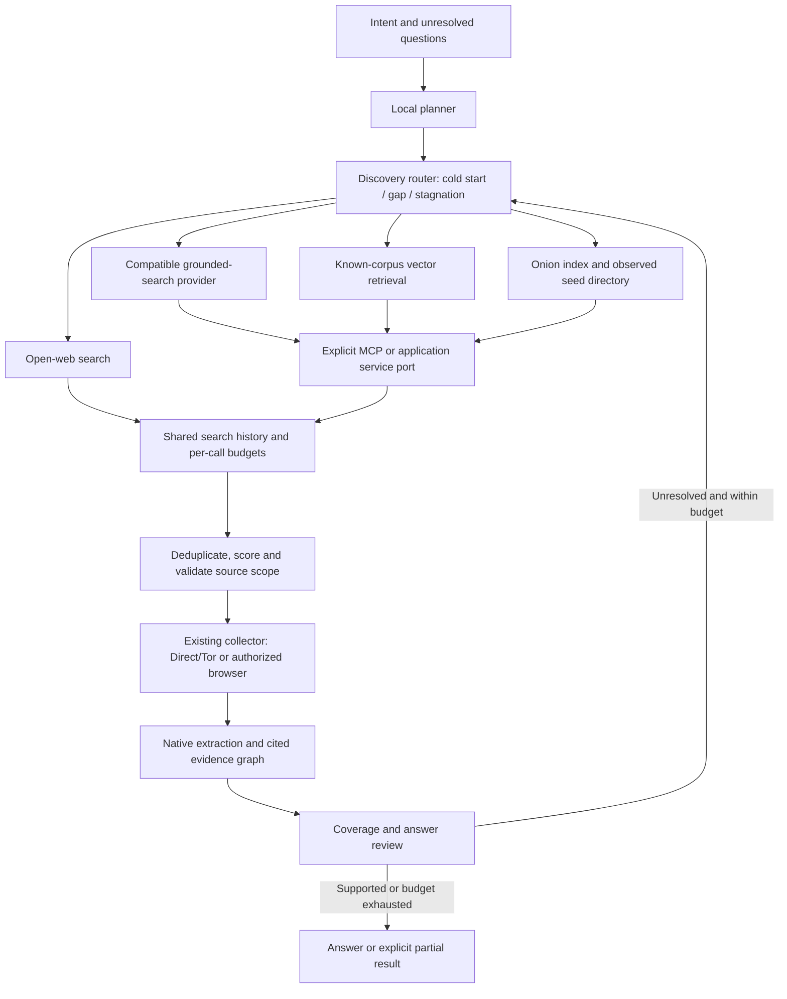

# Grounded discovery: cold starts and escaping dead ends

Status: **MCP lead consumption and initial configured multi-provider routing /
stagnation switching implemented in development source**. Real-provider acceptance
and the richer design requirements below remain open; see [routing](DISCOVERY_ROUTING.md).
The current `ResearchLoop` accepts an intent without seeds, plans
queries and follows evidence gaps. `GroundedSearch`, `SearchHistory`, scope
compilation and retained discovery bytes already exist. The concrete Collector
selects one SearXNG/MCP provider or an explicit provider set, retaining separate
per-call identities and budgets. See [MCP leads](MCP_LEADS.md).
Dedicated corpus adapters and broader provider/strategy acceptance remain open.

## Required behavior

Given an intent, discover promising sources without requiring the caller or
model to know a URL. When a branch yields no usable sources or no additional
coverage, change discovery strategy and provider within explicit budgets. Both
open-web and onion research are first-class source domains. A discovery service
is not permission to access a source, and a result snippet is not original
document evidence.

### Grounding is not one interchangeable thing

- **Public-web grounding** supplies source URLs observed by a search provider.
  An automated frontier may consume those URLs only when the provider's
  applicable contract permits that use. Generated answer prose is not an
  extracted source document.
- **Corpus/vector grounding** retrieves source-bound documents or chunks from a
  known index. It must retain corpus/document identifiers, retrieval revision,
  source URL when present, native excerpt and offsets. Similarity is not a
  probability of relevance or truth. Index coverage must be explicit.
- **MCP is a transport/tool boundary**, not a search engine or an index. An
  application binds an explicit endpoint and exact tool/output schema; the
  adapter translates the response into the shared discovery contract. No
  ambient credential, tool-name guessing or arbitrary tool invocation.

Google's current official documentation distinguishes public Search grounding
from grounding against a configured search data store. It documents citation
annotations on Interactions responses; older GenerateContent responses have a
different grounding-metadata wire. Pin each decoder's dialect explicitly rather
than searching generated prose for URLs. Sources inspected 7 October 2026:
[Google Search grounding](https://ai.google.dev/gemini-api/docs/google-search/),
[Google corpus grounding](https://docs.cloud.google.com/vertex-ai/generative-ai/docs/grounding/grounding-with-vertex-ai-search),
[MCP tool/result contract](https://modelcontextprotocol.io/specification/2025-06-18/server/tools).

The default planning/analysis models remain self-hosted. Consuming externally
produced grounding does not select Google as an inference backend. Calling an
external grounding service is separately enabled, credential-bound and charged;
the existing `self_hosted_only` model policy must not be silently relaxed.

### Google Search grounding is not an automatic crawl-seed API

The Gemini API terms effective 23 March 2026, inspected 7 October 2026, explicitly
prohibit using Grounded Result links to identify destination pages for crawling
or scraping, and restrict analysis/caching of those results. Therefore ordinary
Google Search grounding must **not** feed this automatic frontier, graph
extraction or persistent discovery archive. Passing it through MCP does not
change those terms. A different licensed search/corpus service is admitted under
its own compatible documented contract, not an override purporting to change
Google's terms.

Google-grounded answer display is a separate analyst-facing operation, subject
to its display/attribution contract. It must not be labeled a stored source
document or converted into crawl seeds. The collector instead uses a compatible
search API, operator-owned index/directory, or corpus retrieval whose source and
acquisition permissions permit the requested collection. Source:
[Gemini grounding use restrictions](https://ai.google.dev/gemini-api/terms#grounding-with-google-search).

## Composition and ownership

Reuse `GroundedSearch`'s final accounting contract. Providers remain narrow
request adapters; they must not own another frontier, research loop or model
registry. A router owns strategy state for one run, not globally. Every actual
provider attempt has its own reservation, observation/refusal and cost. Do not
hide several searches inside one nominal query charge. Concurrent calls retain
their actual provider identities and response bindings in `SearchHistory`;
result/archive readers must no longer assume one provider served every query.

## Typed, versioned configuration

The new optional discovery section must own provider IDs/revisions, domain
coverage (`open_web`, `onion`, `known_corpus`), response dialect, exact service
endpoint/tool binding, limits, language/query strategies and eligibility. Secrets
are separate injected inputs. No hosted endpoints, model selections, onion
addresses or operational thresholds are hard-coded in Python.

Policy fields must include:

- Provider order/weights per domain and whether cold-start fan-out is enabled.
- Per-provider calls, bytes, wall time, result limits and concurrency; total
  discovery spend remains bounded by the shared run budget.
- Stagnation window, minimum coverage gain, minimum newly accepted relevant
  documents, retry/circuit-breaker policy and maximum strategy changes.
- Permitted query disclosure: original intent, unresolved-question-only or
  explicit minimized query. Private evidence text is never automatically sent
  to a public discovery provider.
- Onion index/directory identity and revision, seed observation age and health
  policy, open-web-through-Tor choice and cross-domain expansion permission.
- Corpus/index coverage declaration and source locator mapping. An asset ID is
  not fetchable by HTTP unless an explicitly bound reader supplies its bytes.
- Provider use/retention contract. Analyst-display-only results do not enter the
  automatic frontier or persistent result archive. Backend-specific restrictions
  are not relaxed by wrapping the service in an MCP tool.

Omitting this section preserves existing single-provider recipes and serialized
records. Enabling a provider without its bound client or required credential
refuses before research begins. Effective non-secret configuration is retained
in the run receipt. Provider/service unavailability is distinct from an empty
successful search and from inadequate corpus coverage.

## Cold start

1. Plan question-bound queries from the original intent and configured language
   strategies. Do not have the model fabricate websites or onion addresses.
2. Query eligible discovery providers concurrently, within independent and
   shared limits. An offline configured index is useful without public egress.
3. Normalize actual source locators; retain permitted provider response bytes,
   queries, citation metadata, timestamp, revision and source-bound retrieval
   scores. A provider incompatible with this automated/archive contract is not
   eligible for collection.
4. Rank/deduplicate candidates with the existing local relevance/embedding path.
   A redirect/citation proxy URL is retained as such; do not pretend it names the
   final publisher before guarded resolution.
5. Fetch native documents through the existing source-domain transport and
   entitlement boundary. Only retained source evidence can support an answer
   or semantic graph claim.

## Dark-web starting points

Supply an explicitly configured searchable onion corpus or observed seed
directory and/or a bound onion-search service. It may be local or provided
through the application's MCP server. Validate v3 onion addresses/checksums
using the existing Tor connector; availability/staleness is an observation, not
proof of source reliability. Fetch onion sources only through configured Tor.

When permitted, open-web search can discover references to onion services, then
those observed references can enter the onion frontier. Open-web-through-Tor is
a separate configured transport choice; it does not make an ordinary web index
cover onion content. On-source links, references, aliases and entity names can
expand later queries. Do not crawl login-protected forums without the caller's
entitled session. A deployment with no onion index, eligible observed seeds or
usable search service returns `no_discovery_source` as an unresolved gap; it
cannot claim complete dark-web coverage.

## Escaping an unproductive branch

Track measurable progress after collection: newly retained relevant documents,
new cited coverage, repeated candidates, access refusals and dead/stale sources.
After the configured stagnation window, issue an explicit recorded strategy
change: another query family/language, aliases supported by retained evidence,
another provider/index, source-reference expansion, or a permitted domain pivot.
Do not repeatedly submit the same query against the same unchanged index. Keep
the original question pack immutable; record why the next search is expected to
address a particular unresolved question. Provider failure triggers only its
explicit bounded fallback policy, not an unbounded loop.

Round-boundary resume restores strategy history, query deduplication, circuit
state, successful responses and cumulative spend. Uncertain in-flight service
calls remain explicit and are not silently retried or charged as zero.

## Bounded implementation and acceptance

1. Add typed provider/discovery configuration, request/response provenance and
   paired readers; preserve absent-field legacy serialization.
2. Implement a generic application-bound MCP search/corpus adapter and compatible
   provider-specific dialect decoders. Malformed/un-grounded prose is rejected
   as discovery, and structured tool errors remain failures. Ordinary Gemini
   Search grounding stays outside automatic collection; any separate display
   integration follows its own service contract.
3. Integrate multi-provider accounting/history and Collector composition with
   cold-start fan-out and deterministic stagnation changes. Do not bypass the
   existing source scope/transport or model-policy boundary.
4. Exercise one complete intent run against controlled open-web and onion
   discovery fixtures: empty first provider, fruitful fallback, no fabricated
   locators, private-query policy, independent spend and resume readback.
5. Verify the actual application MCP tool/schema and one real cold-start and
   one stalled-branch recovery. Record provider/index coverage and limitations;
   a fixture or successful import does not prove retrieval adequacy.

These are additional closure requirements alongside the browser, document,
real-model, deployment and autoscaling requirements tracked in `C0.md`.
