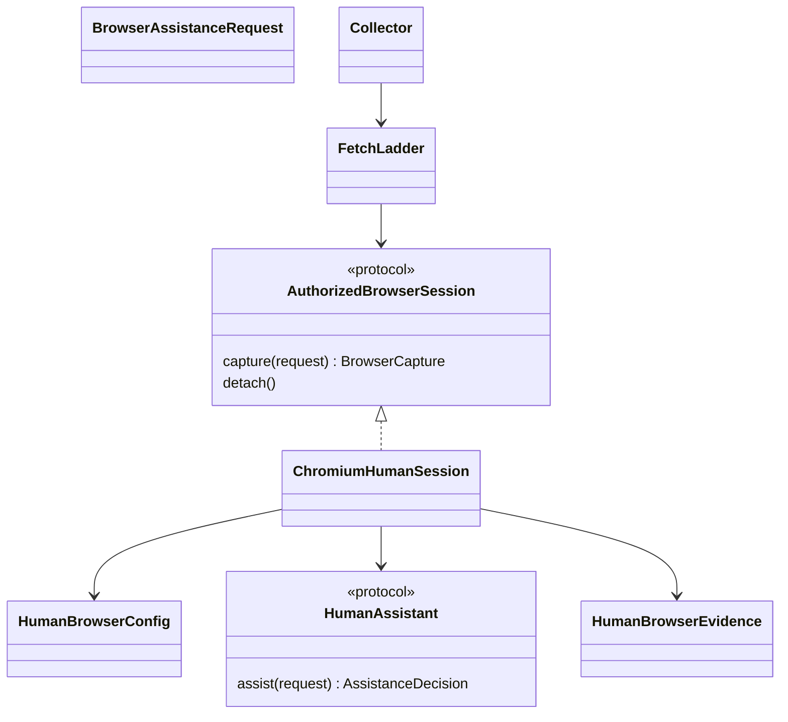

# Human-assisted, same-browser collection

Status: **same-target Chromium capture and Collector composition implemented in
development source**. Native extraction, graph/archive readers and completed-round
resume retain its distinct DOM evidence. Full-package verification and real
publisher acceptance are separate; this does not close the full collector row.
The existing authorized HTTP sessions and local
challenge gateways remain separate, working mechanisms. Their cookies are not
silently imported into this mechanism.

Combined browser/MCP development source passed the complete `scripts/gate.sh`
on 7 October 2026 UTC: **739 passed, exit 0**, in 629.45 seconds, plus Ruff,
formatting and strict mypy. Python 3.11.16 imported this worktree's source;
installed Chromium 151.0.7922.34 exercised controlled loopback browser fixtures.
This includes Collector extraction, graph/archive readback and completed-round
resume, not real-publisher or verified Tor-browser acceptance. Test outputs were
placed on an explicitly selected real-volume directory: available filesystem
space alone did not reveal the user's exhausted tmpfs quota. `GHIMERA_GATE_WORK`
now selects that gate workspace without changing production Python.

The collector should be a proxy for an authorized human. A person may complete
a site's ordinary sign-in, subscription or challenge in an explicitly selected
browser; collection then continues in that same session. A clearance cookie
replayed by a different HTTP client cannot establish this capability. Nor can
the existing noninteractive, networkless renderer: its evidence explicitly
claims a fresh isolated context and parent-owned GET requests.

## Configuration and lifecycle owner

Add an optional versioned `HumanBrowserConfig` at the existing configuration
parse boundary. Omission disables the mechanism and preserves prior serialized
recipes. All operator choices are inputs: adapter/revision, explicit dedicated
browser endpoint and target identity, exact eligible origins/path prefixes,
transport mode, assistance reasons, maximum assistance attempts, human deadline,
capture/read limits, and concurrency. The policy must declare whether the
browser is caller-managed or collector-owned and the actual network boundary.
It must not claim Linux namespace isolation or parent-fetched resources unless
the implementation actually provides those properties.

The initial Chromium implementation may attach only to an explicitly bound
local control endpoint and dedicated target. No browser/profile discovery,
first-tab selection, account import, public debugger binding or identity
substitution. Endpoint binding is application configuration, not authority to
operate the browser. A caller-managed browser must not be closed, have its
cookies cleared, or have unrelated tabs modified on timeout/cancellation.
Collector-owned contexts may clean up only their own explicitly recorded state.

Direct and Tor sessions need distinct, explicit transport declarations. A Tor
session must preserve that browser's configured route across assistance and
capture; no direct retry or HTTP client's independently chosen circuit. An
implementation that cannot verify the selected route must refuse that mode,
not stamp a Tor receipt. Browsing subresources in a separately networked user
browser is an operator-managed boundary, not the existing HTTP guard. Require
explicit deployment egress control and record that distinction.

## Small contracts, existing collection owner

The concrete capture port is composed through the existing FetchLadder and
Collector. It does not add another research loop or storage owner.

The `FetchLadder` remains the ordering/accounting owner. A narrowly injected
session port handles an explicitly selected barrier or browser-only source;
it does not implement a second frontier, scorer, extractor, research loop or
graph writer. The person grants no new crawl scope through a completion signal.
An assistance request identifies the original URL, barrier, policy digest,
exact owned target and deadline. Its decision is resume, decline or timeout,
not a relevance label or a generated claim. Missing assistance binding refuses
before browser work. Attempts reserve their allowance before interaction and
cannot recurse indefinitely.

Do not model an assisted capture as the current `RenderResult`: its isolation,
source-I/O and lifecycle guarantees are different. Use a distinct versioned
`HumanBrowserEvidence` and shared extraction-input accessors only where their
guarantees genuinely agree. The existing isolated renderer must retain its
behavior and old wire serialization.

## Capture and immutable evidence

A successful capture binds the exact eligible final URL, browser/session and
target identifiers, policy/adapter revision, assistance observation, original
document response when actually observed, and final DOM digest. Response bytes
and displayed DOM are separate evidence. Do not pair a previously fetched
challenge response with a later authenticated DOM and describe the former as
the authenticated document's original bytes.

If only displayed DOM is observable, define that acquisition mode explicitly
and retain it as browser-observed content, not invented HTTP response evidence.
Its extractor, document, ledger, graph and archive readers must all understand
that source kind before its first writer ships. If navigation produces a PDF
download, use the actual bounded download and existing document parser; do not
substitute a viewer's HTML for the PDF.

No cookie values, authorization headers, storage state, passwords, challenge
tokens, screenshots of private unrelated tabs or raw debugger logs enter a
receipt. Returned content itself may be private; retain the existing private
archive requirements. Host changes and redirects require fresh eligibility
checks. A login-success signal or disappearance of a challenge is not success:
the retained document must pass the existing type, extraction, scoring and
judge boundaries.

Account document captures and actual collector-owned requests through the run's
existing budget. Browser subresource traffic and human interaction are not
automatically metered by that budget: their bounds must be independently
enforced or explicitly stated in the operator-managed boundary. Never report
unobserved browser bytes or requests as zero.

## Bounded implementation and acceptance sequence

1. Typed policy, assistance/capture evidence, reader/version validation and
   unchanged legacy recipe round trips. Explicit missing/ambiguous bindings
   must refuse before browser contact.
2. Concrete same-target Chromium adapter and application assistance binding.
   Exercise an actual browser against a controlled local interactive source:
   it must use the same tab/session before and after assistance, retain real
   content, and detach safely on decline, timeout and cancellation.
3. Fetch/Collector, extraction, graph/journal/archive and completed-round resume
   composition. Prove no cross-origin credential copying, no unauthorized
   scope expansion, no auto-retry of uncertain interaction and no false
   isolation/HTTP provenance. Exercise independently configured Direct/Tor
   behavior rather than inferring transport from the adapter name.
4. Authorized real publisher/challenge acceptance and a complete intent run.
   A local fixture or adapter import is not this acceptance. A site needing
   an unavailable entitlement remains an explicit partial-result gap.

No new model admission is required for the first three steps. Real intent
quality still needs the separately configured actual model/search services.
Do not weaken semantic validation to make browser acceptance appear complete.

## Implemented core API and limits

`HumanBrowserConfig` is an optional recipe at the existing `GhimeraConfig`
boundary. Its omission preserves legacy serialized recipes. The
[non-active fragment](../examples/human-browser.toml) contains explicit example
choices, not library defaults. The explicit local WebSocket debugger URL and
target are caller inputs; discovery of a first tab, default profile or browser
port is not implemented. Keep the local control endpoint/private recipe private;
captures retain the policy digest, not the control URL.

`ChromiumHumanSession(config, assistant=human_port)` implements the narrow
`AuthorizedBrowserSession.capture(url)` port. Each operation connects to the
configured local Chromium endpoint, binds the exact target ID, navigates that
target, reads bounded UTF-8 DOM bytes in an isolated JavaScript world and, when
needed, calls the application-supplied `HumanAssistant.assist(request)` port.
The adapter supplies no credential form-filler, CAPTCHA clicks or challenge
solver. A configured assistance mechanism without a bound port refuses before
contact. The caller can also configure zero assistance attempts/reasons and use
an already entitled session.

The human's decision must bind the exact immutable request digest, capture ID,
target, URL, policy, observed barrier DOM hash and attempt. A resume signal does
not suppress another barrier or expand capture scope. Requests and captures are
deadline-bounded, and the same adapter instance serializes its one target.
Separate instances must not share that target concurrently: lifecycle ownership
is the application's, not a package-global registry.

Every capture disconnects its own driver without closing the caller's browser
or context or clearing cookies. Decline, timeout, stale decisions, exhausted
assistance, callback errors and cancellation retain their observations and
actual DOM bytes read. The success evidence accounts discarded assisted
interstitials as well as the final retained DOM. Cookie/header values, storage
state and other tabs' content are not read into the evidence. Source content
can itself be private; this is not a redaction mechanism.

`BrowserCapture` stores only browser-observed DOM with a digest and exact
content binding, not a fictional HTTP status/raw-response body. It has a paired
JSON reader and rejects changed DOM, policy/target changes, invalid assistance
ordering and hidden discarded-DOM spend. It reports subresource request/byte
counts as **unknown**, not zero. The operator owns browser egress, ongoing
JavaScript, redirects and subresource/network bounds. This core does not claim
the parent HTTP client's DNS/redirect/robots enforcement or network isolation.

Direct routing is explicitly **operator-declared, not independently verified**.
Tor configuration refuses before attachment: browser attachment alone cannot
prove Tor routing or prevent direct fallback. The existing guarded Tor HTTP
route remains separate. Native PDF/download capture, passive-driver alternatives
and transport verification are still required follow-ups, not silent HTML
substitutes.

## Collector composition (unreleased)

`Collector(config, human_assistant=application_port)` and its `from_toml`
equivalent accept the explicit application-owned assistance port. A configured
assistance recipe without that port refuses before network work. A zero-assistance
recipe can collect from an already entitled browser session. Development source
now supplies an opt-in terminal port through `ghimera.collector-command/3`; see
[interactive command](TERMINAL_ASSISTANCE.md). It reuses this browser mechanism
and the existing complete-result archive rather than creating another collector.

`HumanBrowserRoute` reuses FetchLadder's run budget, scope, concurrency and
cadence. It is selected only for configured origins. A denied path, failed
interaction or exhausted capture on a selected origin cannot fall back to the
HTTP client's different session. The existing guarded HTTP route obtains robots
policy first; the existing explicit recorded exact-host override remains
available. This top-level decision does not claim to meter or control the
operator-managed browser's subresource traffic.

The remaining run byte/time allowance bounds each capture and human deadline.
Discarded interstitial DOM bytes count against the same allowance. Failed and
cancelled assistance retains its observations and measured DOM spend; callback
exceptions do not enter the ledger. HTML extraction consumes UTF-8 observed DOM
without labeling it as raw HTTP response bytes or isolated-renderer output.
Documents and graph document nodes retain the exact capture identity. Graph
identity includes that capture identity so repeated identical DOM observations
do not collide with differing acquisition evidence.

Paired Harvest/result archive readers bind document and graph metadata to the
successful ledger capture and effective policy. Metadata stripping, invented
HTTP statuses, changed DOM and changed session/target/policy are rejected.
Completed-round continuation retains these captures and source bodies without
requiring another browser navigation. These are source capabilities, not a
published release or real-site acceptance claim.

## Bounded development evidence

On 7 October 2026 UTC, the new adapter plus existing HTTP, source-session,
Collector/command, fetch conformance and package-boundary checks passed
**98 tests, zero failed/skipped**, in 106.92 seconds using
`/tmp/chimera-c0-20261006/.venv/bin/python` (Python 3.11.16), importing
`/tmp/chimera-c0-20261006/src/ghimera/__init__.py`. After explicit isolated-world
reading and additional exact non-first-tab/tamper cases, the final human-browser
module passed **24 tests, zero failed/skipped**, in 30.27 seconds on that same
interpreter and import path. Ruff passed over all source/tests; strict mypy
passed over 100 source files. These are separate runs, not additive coverage
counts. The earlier complete 696-test recovery gate predates this adapter and
does not verify it; a new complete package gate remains required before merge.

The browser checks used installed real Chromium with owned temporary profiles
and loopback fixture source/control endpoints, not mocked browser DOMs. A
fixture-only assistant clicked a controlled local button to simulate human
completion; it is not a real CAPTCHA/login or publisher acceptance. Evidence
covers same-tab/session continuity, retained session cookies, capture/readers,
discarded-interstitial spend, stale decisions, decline, timeout, callback error,
cancellation, exact target selection with an unrelated first tab, scope refusal,
bounded DOM reads, page-script encoder tampering and caller-browser survival.
Ambient platform tokens were unset. No external collection, model/GPU calls,
pool changes, publication or deployment occurred.

For bounded real English and Traditional Chinese public-publisher captures and
fresh-process paired evidence readback, see
[public-document evidence](C1_HUMAN_PUBLIC_EVIDENCE.md). That acceptance does not
extend to human login/challenges, representative publishers or browser Tor.

## Vendor interface evidence

Official Playwright documentation inspected 7 October 2026 describes
[CDP attachment](https://playwright.dev/python/docs/api/class-browsertype#browser-type-connect-over-cdp)
to an existing Chromium browser and explicitly warns that its fidelity is
lower than the native Playwright connection. Its
[interactive pause](https://playwright.dev/python/docs/api/class-page#page-pause)
requires headed mode. These support a concrete implementation route, not a
claim that browser attachment provides isolation, lawful access, complete
capture provenance, arbitrary-site compatibility or successful challenges.
Verify the actual pinned Patchright API and lifecycle before implementing the
adapter; do not assume a Playwright method has identical patched behavior.
