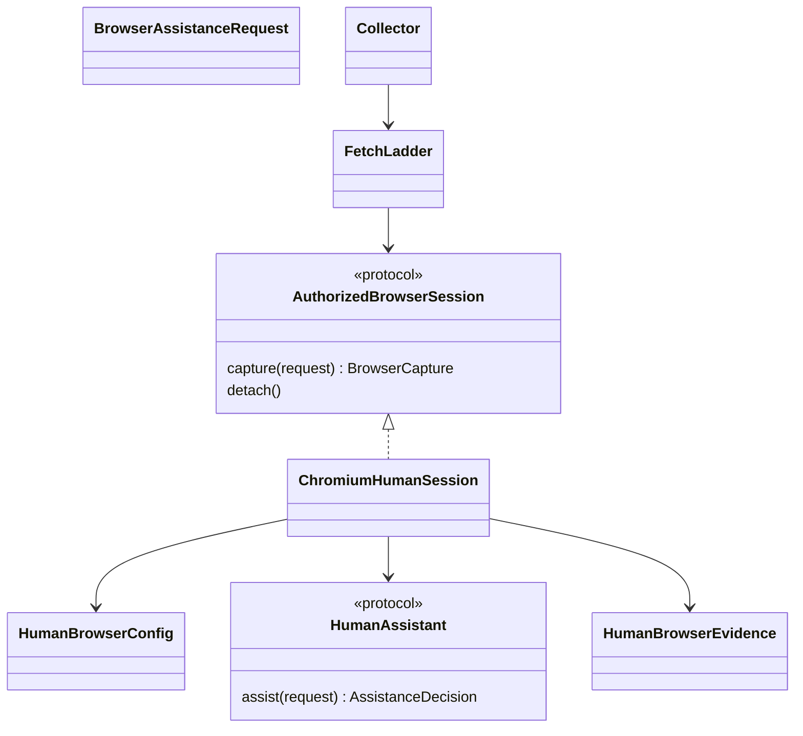

# Human-assisted, same-browser collection

Status: implementation contract, **not implemented or accepted**. This closes
no acceptance row by itself. The existing authorized HTTP sessions and local
challenge gateways remain separate, working mechanisms. Their cookies are not
silently imported into this mechanism.

The collector should be a proxy for an authorized human. A person may complete
a site's ordinary sign-in, subscription or challenge in an explicitly selected
browser; collection then continues in that same session. A clearance cookie
replayed by a different HTTP client cannot establish this capability. Nor can
the existing noninteractive, networkless renderer: its evidence explicitly
claims a fresh isolated context and parent-owned GET requests.

## Configuration and lifecycle owner

Add an optional versioned `HumanBrowserConfig` at the existing configuration
parse boundary. Omission disables the mechanism and preserves prior serialized
recipes. All operator choices are inputs: adapter/revision, explicit dedicated
browser endpoint and target identity, exact eligible origins/path prefixes,
transport mode, assistance reasons, maximum assistance attempts, human deadline,
capture/read limits, and concurrency. The policy must declare whether the
browser is caller-managed or collector-owned and the actual network boundary.
It must not claim Linux namespace isolation or parent-fetched resources unless
the implementation actually provides those properties.

The initial Chromium implementation may attach only to an explicitly bound
local control endpoint and dedicated target. No browser/profile discovery,
first-tab selection, account import, public debugger binding or identity
substitution. Endpoint binding is application configuration, not authority to
operate the browser. A caller-managed browser must not be closed, have its
cookies cleared, or have unrelated tabs modified on timeout/cancellation.
Collector-owned contexts may clean up only their own explicitly recorded state.

Direct and Tor sessions need distinct, explicit transport declarations. A Tor
session must preserve that browser's configured route across assistance and
capture; no direct retry or HTTP client's independently chosen circuit. An
implementation that cannot verify the selected route must refuse that mode,
not stamp a Tor receipt. Browsing subresources in a separately networked user
browser is an operator-managed boundary, not the existing HTTP guard. Require
explicit deployment egress control and record that distinction.

## Small contracts, existing collection owner

The `FetchLadder` remains the ordering/accounting owner. A narrowly injected
session port handles an explicitly selected barrier or browser-only source;
it does not implement a second frontier, scorer, extractor, research loop or
graph writer. The person grants no new crawl scope through a completion signal.
An assistance request identifies the original URL, barrier, policy digest,
exact owned target and deadline. Its decision is resume, decline or timeout,
not a relevance label or a generated claim. Missing assistance binding refuses
before browser work. Attempts reserve their allowance before interaction and
cannot recurse indefinitely.

Do not model an assisted capture as the current `RenderResult`: its isolation,
source-I/O and lifecycle guarantees are different. Use a distinct versioned
`HumanBrowserEvidence` and shared extraction-input accessors only where their
guarantees genuinely agree. The existing isolated renderer must retain its
behavior and old wire serialization.

## Capture and immutable evidence

A successful capture binds the exact eligible final URL, browser/session and
target identifiers, policy/adapter revision, assistance observation, original
document response when actually observed, and final DOM digest. Response bytes
and displayed DOM are separate evidence. Do not pair a previously fetched
challenge response with a later authenticated DOM and describe the former as
the authenticated document's original bytes.

If only displayed DOM is observable, define that acquisition mode explicitly
and retain it as browser-observed content, not invented HTTP response evidence.
Its extractor, document, ledger, graph and archive readers must all understand
that source kind before its first writer ships. If navigation produces a PDF
download, use the actual bounded download and existing document parser; do not
substitute a viewer's HTML for the PDF.

No cookie values, authorization headers, storage state, passwords, challenge
tokens, screenshots of private unrelated tabs or raw debugger logs enter a
receipt. Returned content itself may be private; retain the existing private
archive requirements. Host changes and redirects require fresh eligibility
checks. A login-success signal or disappearance of a challenge is not success:
the retained document must pass the existing type, extraction, scoring and
judge boundaries.

Account document captures and actual collector-owned requests through the run's
existing budget. Browser subresource traffic and human interaction are not
automatically metered by that budget: their bounds must be independently
enforced or explicitly stated in the operator-managed boundary. Never report
unobserved browser bytes or requests as zero.

## Bounded implementation and acceptance sequence

1. Typed policy, assistance/capture evidence, reader/version validation and
   unchanged legacy recipe round trips. Explicit missing/ambiguous bindings
   must refuse before browser contact.
2. Concrete same-target Chromium adapter and application assistance binding.
   Exercise an actual browser against a controlled local interactive source:
   it must use the same tab/session before and after assistance, retain real
   content, and detach safely on decline, timeout and cancellation.
3. Fetch/Collector, extraction, graph/journal/archive and completed-round resume
   composition. Prove no cross-origin credential copying, no unauthorized
   scope expansion, no auto-retry of uncertain interaction and no false
   isolation/HTTP provenance. Exercise independently configured Direct/Tor
   behavior rather than inferring transport from the adapter name.
4. Authorized real publisher/challenge acceptance and a complete intent run.
   A local fixture or adapter import is not this acceptance. A site needing
   an unavailable entitlement remains an explicit partial-result gap.

No new model admission is required for the first three steps. Real intent
quality still needs the separately configured actual model/search services.
Do not weaken semantic validation to make browser acceptance appear complete.

## Vendor interface evidence

Official Playwright documentation inspected 7 October 2026 describes
[CDP attachment](https://playwright.dev/python/docs/api/class-browsertype#browser-type-connect-over-cdp)
to an existing Chromium browser and explicitly warns that its fidelity is
lower than the native Playwright connection. Its
[interactive pause](https://playwright.dev/python/docs/api/class-page#page-pause)
requires headed mode. These support a concrete implementation route, not a
claim that browser attachment provides isolation, lawful access, complete
capture provenance, arbitrary-site compatibility or successful challenges.
Verify the actual pinned Patchright API and lifecycle before implementing the
adapter; do not assume a Playwright method has identical patched behavior.
