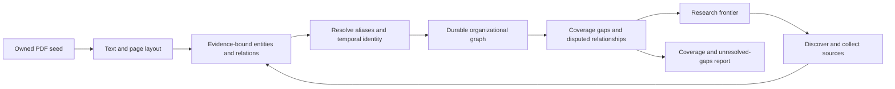

# Document-seeded organizational network research

Owner use case, 6 October 2026: supply a PDF describing the CCP organization,
extract its entities and organizational structure into a knowledge graph, then
research and expand the graph until its scope and remaining gaps are understood.
This is a planned acceptance case, not a claim that the current package already
implements the complete workflow.

## Current boundaries

- Implemented in source: pinned local PDF/DOCX seed intake through the assembled
  intent API/command before planning; PDF parsing with retained source bytes and layout; direct/Tor
  collection; intent planning/search/coverage/answer review; exact native-text
  citations; configurable graph vocabulary and source-bound edge validation;
  durable research transactions and complete result archives. Unreleased source
  now includes model-backed native entity/relationship extraction and projection
  as explicitly model-asserted, source-local observations. A configured bounded
  graph view feeds those observations to subsequent within-run planning calls.
- Not implemented: alias resolution with evidence-preserving merge/split;
  persistent multi-run expansion; platform graph publication.
- Not accepted: representative Chinese organization charts, scanned charts,
  diagram topology, entity completeness, temporal hierarchy correctness or
  independent entailment quality. OCR text alone does not recover connecting
  arrows or reporting structure.

The graph records intent, questions, queries, sources and document versions.
Configured semantic extraction now produces source-local mention/relationship
observations. This does not equate mentions across sources, corroborate a claim,
interpret chart arrows or persist an expansion frontier across runs. The
planner's bounded graph view can motivate within-run follow-up discovery, with
retained references to the observed entities/relationships and explicit omissions.

## Intended reusable workflow

Use typed injected ports for seed import, semantic extraction, entity resolution,
graph storage and frontier planning. Reuse the existing guarded source collector,
model transport, evidence contexts, graph validation and archive owners rather
than constructing another crawler or provider registry. A graph store is not
owned by the LLM; the extractor proposes observations and the graph boundary
validates them before durable acknowledgement.

## Data and evidence contract

Entities distinguish people, organizations and positions. Office holders are
not interchangeable with the offices; names in Chinese, English and other
languages are aliases rather than automatically identical entities.
Relationships use a configured ontology such as `subordinate_to`, `reports_to`,
`holds_position` and `member_of`. Preserve quoted source evidence, document
version, page/native span, extraction revision, attribution and validity dates.
Unknown dates remain unknown rather than being filled from model memory.

Model score, alias similarity and co-occurrence are not proofs of affiliation.
Keep asserted, corroborated, disputed and unresolved observations distinct.
Contradictory sources retain separate observations instead of overwriting each
other. Evidence is assessed for entailment as well as exact quotation matching.
Visual-only claims need source-bound page/bounding-box and diagram evidence;
inventing a textual citation for a connecting line is not acceptable.

The standalone package emits neutral graph records. Downstream adapters own the
receiving knowledge graph's ontology, permissions and publication contract.

## Expansion and stopping policy

Operational choices belong in a versioned recipe: target entities/subgraphs,
relation types, date range, source policy, query/document/model budgets, expansion
depth, per-entity coverage expectations and stopping criteria. No source model
can silently expand those permissions or resource limits.

Each research frontier item identifies the entity or relationship gap that
motivated it. Prioritize unresolved parent/child/office-holder relationships,
alias ambiguities and contradictory evidence. Existing research observations
are reused without silently treating a previous model conclusion as a source.
Checkpoint completed observations and pending frontier work for restart-safe
continuation; concurrent collection does not wait for unrelated graph queries.

Completion means the configured coverage target is met, with source-backed
findings and an explicit unresolved report. Budget exhaustion, stale sources,
refusals or irreducible contradictions produce partial coverage, never a claim
that an entire organization has been exhaustively mapped.

## Bounded acceptance deliverables

1. Local PDF seed intake and provenance with immutable source versions:
   implemented in unreleased source; bounded actual PDF/DOCX parser and composed
   command/archive checks pass. The official native Chinese constitutional PDF
   also passes production-extractor and serialized-reader replay with retained
   source MIME/bytes; representative chart/organization-corpus acceptance remains
   open.
2. Semantic entity/relation extraction over a real organization PDF, including
   page coverage, omissions and visual-chart limitations: source implementation
   and controlled native-document checks exist; real organization-PDF/model
   accuracy acceptance remains open. Nine actual served-model trials produced
   no accepted entity/relationship claims: the original profile failed proposal invariants,
   while explicit mention-key/native-span profiles reached structurally valid
   proposals that still failed native projection or mislabeled concepts. The
   second-family trial initially exhausted its output budget without final text.
   Explicit generation controls returned final JSON in subsequent trials, but
   two empty windows are not entity completeness and role/span failures remain.
   Configured ontology definitions, distinct-model checks, quarantine and
   source-bound planning gaps are now implemented in unreleased source;
   their real-model quality acceptance remains open. A tenth actual diagnostic
   reviewed the retained proposals with a distinct pinned model family: 15
   projected windows retained 54 mention observations and 12 model-asserted
   relationships, but source inspection still found role/entailment errors
   and two unresolved windows. Those are not 54 resolved entities or a
   validated organization graph. See
   [SEMANTIC_VERIFICATION.md](SEMANTIC_VERIFICATION.md) and
   [ORGANIZATION_MODEL_EVIDENCE.md](ORGANIZATION_MODEL_EVIDENCE.md), with the
   trial-10 results in [ORGANIZATION_INDEPENDENT_EVIDENCE.md](ORGANIZATION_INDEPENDENT_EVIDENCE.md).
   A dimensioned follow-up reviewed three unchanged failure windows: responses
   and graph replay worked, but the native-name false negative and both abstract
   concept/type errors persisted. Its three retained mention occurrences and
   zero organizational relationships are not a validated organizational graph.
   See [ORGANIZATION_FACTORIZED_EVIDENCE.md](ORGANIZATION_FACTORIZED_EVIDENCE.md).
   A subsequent bilingual-ontology diagnostic made three new extraction calls
   and selected an explicit election passage. The present-name review improved
   and the earlier abstract-concept outputs disappeared, but extraction still
   invented absent titles and omitted a present institution; the positive
   relationship review reached its request deadline. Two successful projections
   retained one mention and zero organizational relationships. This is mixed
   diagnostic evidence, not quality acceptance; see
   [ORGANIZATION_BILINGUAL_EVIDENCE.md](ORGANIZATION_BILINGUAL_EVIDENCE.md).
   Verification/3 checks of the unchanged proposal remain failed: an HTTP error
   preceded the larger client deadline, a control review failed validation, and
   a faster low-reasoning response returned no final-answer content. New
   non-secret completion-shape telemetry identifies that failure without
   promoting intermediate reasoning into graph evidence. See
   [ORGANIZATION_GROUNDED_EVIDENCE.md](ORGANIZATION_GROUNDED_EVIDENCE.md).
3. Alias/temporal identity and conflict preservation across real documents:
   source now includes an explicit identity-aware planning view with same-name
   and asserted-alias hypotheses, potentially competing dated claims and
   follow-up query references. Original observations are retained, not merged.
   Actual identity decisions/merge-split and real-document quality acceptance
   remain open. See [IDENTITY_PLANNING.md](IDENTITY_PLANNING.md).
4. Graph-driven research over a small explicitly scoped organizational subtree,
   proving that findings change its next research frontier: within-run source
   implementation and controlled composed-loop checks exist; real subtree/model
   acceptance remains open.
5. Restart-safe graph/frontier continuation and idempotent output projection:
   completed-round suspend/resume is implemented in unreleased source, with a
   fresh-process library/command fixtures and unchanged cumulative observations/budgets. In-flight
   external-call reconciliation and platform output projection remain open.
6. Independent source-entailment checks and a final coverage/gaps report:
   the configured review/quarantine and within-run planning-gap contract is
   implemented. An explicit verification/3 extension adds concrete native
   omission witnesses, neutral unasserted dates and evidence-budgeted gap
   planning; see [SEMANTIC_GROUNDING.md](SEMANTIC_GROUNDING.md). Real-model
   entailment/coverage and complete organizational
   report acceptance remain open.

The organizational workflow may not be closed by the earlier English graphlib
intent diagnostic or by a fixture-only graph test. The graphlib run proves the assembled
document-research path, not this organizational-network capability.

A real official Chinese constitutional PDF has now been retrieved and parsed
with preserved generic MIME/bytes through an explicitly configured binary-PDF
policy. Native text checks do not close organization-model accuracy, chart
topology or the earlier direct acceptance-harness timing inconsistency. Two
subsequent direct production-extractor runs passed without a production patch,
deadline increase or automatic retry; the earlier timeouts remain unexplained.
See [C2_DOCUMENT_DOWNLOAD_EVIDENCE.md](C2_DOCUMENT_DOWNLOAD_EVIDENCE.md).

Local-input configuration, provenance and current acceptance boundaries are in
[LOCAL_INPUTS.md](LOCAL_INPUTS.md).
Semantic-stage configuration, evidence and remaining quality boundaries are in
[SEMANTIC_EXTRACTION.md](SEMANTIC_EXTRACTION.md).
Graph-aware planning configuration and replay are in
[GRAPH_PLANNING.md](GRAPH_PLANNING.md).
Restart-safe round boundaries, API and unresolved-call limitations are in
[CONTINUATION.md](CONTINUATION.md).
