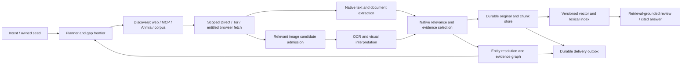

# Ghimera infrastructure PRD

Status: implementation plan with an explicit capability tracker. This supplements
[C0](C0.md), preserving its original acceptance requirements. A source release
does not close a deployment or quality row. Owner additions on 7 October 2026
include selective infographic/image reading and configurable slower/jittered
browsing. The library remains independent of downstream platforms.

## Product

Given an intent or an owned document, discover and collect permitted open-web
and onion evidence, extract native text and relevant visuals, assess relevance,
expand an evidence-bearing graph, and produce a cited answer or an explicit
partial result. Operate as a human's configured proxy where entitled access is
needed. Preserve all original source versions and distinguish observations,
model assertions, corroboration and unresolved questions.

## Required architecture

Bounded queues connect stages; one slow page, OCR job or model call must not block
unrelated eligible work. Source-specific spacing, network/model limits and
backpressure constrain actual resource use. Each item has an owner, immutable
source identity, durable state and terminal success/refusal/quarantine status.
No background task survives its declared lifecycle unnoticed.

Reuse existing invariant-owning fetch/scoring/discovery/graph/citation contracts.
Implement narrow source/model/storage/backend adapters instead of another
crawler framework or global mutable registry. Operational policy is typed,
versioned configuration with safe examples and visible non-secret effective
values. Credentials are separate inputs and source/network/model/import
authorities remain distinct.

## Selective visual processing

Pacific language admission is required per stage, not inferred from a generic
"multilingual" model claim. Priority languages are Simplified and Traditional
Chinese (kept distinct), Japanese, Korean, Tagalog/Filipino, English, Indonesian,
Malay, Vietnamese and Thai. Khmer, Lao, Burmese, Māori and Russian remain
additional coverage targets. The current image profile declares local OCR
packs separately from native-text language detection, the scanned-PDF
recognizer, semantic models and embeddings. Keep originals in their native
script; translation is not a substitute for native OCR or evidence offsets.
Record admission and actual quality separately for each language/script and
layout, including mixed-script and vertical material. Missing models fail
preflight; unvalidated quality remains an explicit acceptance gap.

These languages are requirements for the collector as a whole, not just its
image OCR: discovery, native HTML/PDF extraction, relevant-image selection,
OCR, semantic entity/relation extraction, embeddings and retrieval, and cited
answer generation must each report coverage independently. Simplified and
Traditional Chinese must have distinct script-qualified acceptance cases even
when the language detector reports `zh` for both. Tagalog's language identifier
`tl` and the OCR package label `fil` are explicit adapter names, not a claim of
coverage for every language spoken in the Philippines. An absent or unvalidated
stage must surface its coverage gap rather than silently translate, drop native
material or claim end-to-end support.

The scanned-PDF candidate adds an explicit `ghimera.pdf-models/2` native OCR
engine and Pacific traineddata manifest beside the unchanged English `/1`
recipe. It shares the existing owned Docling worker and source/parse receipts.
This is not admission of semantic models, cross-language search or representative
chart understanding; those each need language-qualified evidence.

The explicit existing RapidOCR `/1` alternative now passes the unchanged
Simplified/Traditional Chinese required-term controls, with retained real parser
receipts; full transcription quality remains unaccepted (one Simplified word
still misreads). The non-active Chinese example is development source and does
not silently replace English or Pacific profiles. Qwen-VL model-assisted OCR
remains a candidate requiring its own service/page/provenance/review boundary
and unchanged-source quality acceptance; see PACIFIC_PDF_CANDIDATE.md. No
language-level capability is inferred from a model's vocabulary or marketing.

1. Discover image candidates from retained HTML/DOM: actual source URL, parent
   document hash, native caption/alt/surrounding text, element locator and declared
   dimensions. Include lazy-image/srcset/picture candidates through an explicit
   deterministic selection policy, not arbitrary page execution.
2. Before any image download, reject declared logos, icons, tracking pixels,
   repeated site decoration and candidates outside configured scope or limits.
   Require topic/intent evidence for an unknown candidate; uncertain items are
   deferred/held. False exclusions are measured on representative pages.
3. Download only admitted candidates through the existing guarded fetch boundary.
   Reuse per-origin pacing, Direct/Tor selection, account session rules and byte/
   time accounting. Validate actual media and dimensions; bound decoded pixels,
   decompression, animation/pages and parser resource use in an owned worker.
4. Run the configured offline OCR recognizer for native text with region boxes,
   confidence observations, reading order and model/artifact identity. Shared
   OCR machinery handles scanned document pages and standalone relevant images.
   Textless but relevant graphics may still need visual interpretation.
5. A separately configured local vision model proposes chart/diagram structure
   over the retained original image and OCR regions. Preserve coordinates,
   supporting labels/lines, direction, uncertainty and provider/model call
   provenance. OCR strings alone do not prove an arrow or relationship.
6. Review the resulting evidence for task relevance and entailment. Only accepted
   visuals enter durable collection or indexing. Transient rejected bytes are
   removed after inspection; retain a small metadata/digest/refusal observation,
   not the image or its vector. Raw HTML preservation is not a promise to remove
   images already embedded inline in that original document.
7. Cite image content hashes, parent/source identities and normalized regions;
   cite OCR spans separately. Never invent text offsets for a diagram arrow.
   Relevant OCR/native text enters the same text chunk/index recipe. An image
   embedding model is optional and explicitly bound; logos are not indexed.

Acceptance requires relevant multilingual infographics, scanned charts, a
textless relevant diagram, decorative logos, false-positive captions, malformed/
oversized media, controlled cancellation and refusal readback. Verify that
rejected images leave no durable original/vector artifact. Real diagram quality
is inspected separately from schema-valid fixture replies.

## Capability tracker and exit criteria

| ID | Requirement | Current state | Closure evidence |
|---|---|---|---|
| I01 | Configurable pacing, nonnegative jitter, origin cooldown and `Retry-After` | Source-complete; included in combined 825-pass gate | Deterministic scheduler and real HTTP checks; robots/global floors preserved; cooled origin cannot monopolize global slots |
| I02 | Concurrent fetch/extract/encode/review stages | Configured concurrency published in 0.4.1; combined 927-pass gate and public artifact readback recorded in RELEASE_041.md | Slow-stage, actual loopback libcurl, byte-reservation, cancellation and interleaved semantic-review witnesses; see CONCURRENT_COLLECTION.md |
| I03 | Durable operation frontier and uncertain-call reconciliation | Round checkpoints built; operation recovery missing | Crash before/after source/model/graph acknowledgement resumes without lost or duplicate evidence and preserves actual spend |
| I04 | Durable original/chunk/vector store and query interface | Native corpus and automatic collector handoff published in 0.4.1; unattended service wiring and representative scale/quality acceptance remain open | Fresh-process native passage retrieval, exact chunk/source/model bindings, index generation isolation and rebuild; handoff failure/retry without refetching; see EVIDENCE_CORPUS.md |
| I05 | Evidence context retrieval/reranking and multilingual discovery | Configured corpus-backed source discovery published in 0.4.1; direct cached-source answer reuse, hybrid/reranking strategies and representative multilingual quality remain open | Real cross-language intent finds retained native evidence, with measurable omissions and independent review |
| I06 | Reliable semantic organization extraction | Built, real Chinese quality acceptance failed | Real organization PDF plus discovered sources yields inspected supported relationships and explicit coverage gaps |
| I07 | Entity resolution, reversible merge/split and temporal identity | Source-local observations/identity questions built; resolution missing | Homonyms, multilingual aliases, offices/people and dated reorganizations remain correct and auditable |
| I08 | Browser-native downloads/interaction workflows and Tor browser networking | Caller-bound PDF/DOCX downloads and native scored-link discovery into initially unknown files published in 0.4.2. Same-session bounded inline originals published in 0.4.3: complete 950-test gate, independent installed native archive acceptance, public W3C sample capture and original public artifact byte equality (RELEASE_043.md). Publisher-specific controls, redirected files, pagination, verified Tor-browser routing and representative entitled-source acceptance remain open | Actual file download, pagination and human session continuation preserve route and exact source/capture evidence; see BROWSER_DOWNLOADS.md and BROWSER_INLINE_DOCUMENTS.md |
| I09 | Maintained Ahmia index and independently hosted MCP lead service | Adapter/payload built; deployment missing | Real index cold start, freshness and dead-end recovery with retained native onion sources, not snippets |
| I10 | Selective images, offline OCR and source-bound visual interpretation | Responsive intake and visual native-corpus passages published in 0.4.1; HTML admission, OCR and reviewed vision built; PDF figure crops, visual answer/graph integration and representative quality acceptance remain open | Relevant infographics enter source/graph/index; irrelevant decoration leaves no stored image/vector; multilingual/chart acceptance; see VISUALS.md |
| I11 | Durable delivery outbox and disk/retention lifecycle | Outbox/local destination/readback-gated pruning published in 0.4.1. Configured background retry and bounded automatic acknowledged-payload pruning are a development candidate; age retention/rotation, remote destination and deployment remain open | Downstream outage/retry/duplicates preserve one acknowledged identity and no original is deleted before durability confirmation; see DELIVERY_OUTBOX.md |
| I12 | Service/API, health, manifests and observability | Library/collector command/journals built; standalone delivery-worker command, JSONL health and graceful shutdown are a development candidate. General collection API and unattended service deployment remain open | Reboot/restart, run/status/pause/resume/cancel, dependency admission, refusal/throughput/backpressure/storage metrics |
| I13 | Corpus connectors and incremental refresh | HTML/reference discovery built; dedicated feeds/corpora missing | Configured sitemap/RSS/API/citation sources and conditional recrawl retain source versions and cross-run reuse |
| I14 | Representative end-to-end quality and runtime acceptance | Bounded English and source diagnostics only | English research, native Chinese PDF/organization expansion and onion investigation produce independently inspected cited results |

Dependencies: I02/I03 establish reliable operation lifecycle; I04/I05 enable
corpus reuse and context quality; I10 shares I04 plus the existing OCR machinery;
I06/I07 consume retained source evidence rather than rewriting it. I11/I12 wrap
those capabilities without taking ownership of source/model internals. I09 may
run on separate hardware, and no downstream platform integration is implied by
publishing the standalone package.

Redirect work is now an integrated development candidate: the full Collector
accepts explicit human_browser.navigation on its caller-bound Page, reuses the
run's robots/cadence/budgets, and retains native source-chain evidence through
documents, graph, journal and archives. Controlled native/importer acceptance
passed 166 tests; see BROWSER_NAVIGATION_GUARD.md for exact environment and scope.
The combined gate passed 999 tests with zero failures/skips under Python 3.11.16;
independent installed-package archive/API/CLI acceptance and a robots-aware
public PDF capture passed. Final 0.4.4 artifact publication is tracked in
RELEASE_044.md. Representative publisher/Tor acceptance remains required;
this is not full I08 closure.

## Delivery and release discipline

Implement and commit bounded rows with tests for their owning contracts and
actual source acceptance where required. Gate the combined source before a tag;
build and independently install the exact wheel, then verify published artifact
bytes. Publish useful incremental versions while keeping incomplete rows explicit;
do not rename "implemented" to "accepted" merely because the suite is green.

No universal success guarantee applies to inaccessible sources, absent indices,
expired entitlements or genuinely insufficient evidence. Such cases return
actionable partial/refusal records. Avoid new passive browser brands or another
large model unless representative acceptance identifies a gap they actually fix.
