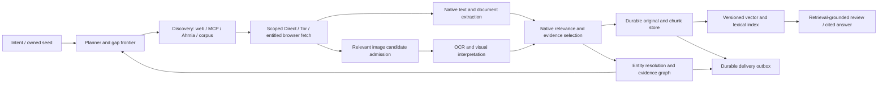

# Ghimera infrastructure PRD

Status: implementation plan with an explicit capability tracker. This supplements
[C0](C0.md), preserving its original acceptance requirements. A source release
does not close a deployment or quality row. Owner additions on 7 October 2026
include selective infographic/image reading and configurable slower/jittered
browsing. The library remains independent of downstream platforms.

## Product

Given an intent or an owned document, discover and collect permitted open-web
and onion evidence, extract native text and relevant visuals, assess relevance,
expand an evidence-bearing graph, and produce a cited answer or an explicit
partial result. Operate as a human's configured proxy where entitled access is
needed. Preserve all original source versions and distinguish observations,
model assertions, corroboration and unresolved questions.

## Required architecture

Bounded queues connect stages; one slow page, OCR job or model call must not block
unrelated eligible work. Source-specific spacing, network/model limits and
backpressure constrain actual resource use. Each item has an owner, immutable
source identity, durable state and terminal success/refusal/quarantine status.
No background task survives its declared lifecycle unnoticed.

Reuse existing invariant-owning fetch/scoring/discovery/graph/citation contracts.
Implement narrow source/model/storage/backend adapters instead of another
crawler framework or global mutable registry. Operational policy is typed,
versioned configuration with safe examples and visible non-secret effective
values. Credentials are separate inputs and source/network/model/import
authorities remain distinct.

## Selective visual processing

Pacific language admission is required per stage, not inferred from a generic
"multilingual" model claim. Priority languages are Simplified and Traditional
Chinese (kept distinct), Japanese, Korean, Tagalog/Filipino, English, Indonesian,
Malay, Vietnamese and Thai. Khmer, Lao, Burmese, Māori and Russian remain
additional coverage targets. The current image profile declares local OCR
packs separately from native-text language detection, the scanned-PDF
recognizer, semantic models and embeddings. Keep originals in their native
script; translation is not a substitute for native OCR or evidence offsets.
Record admission and actual quality separately for each language/script and
layout, including mixed-script and vertical material. Missing models fail
preflight; unvalidated quality remains an explicit acceptance gap.

These languages are requirements for the collector as a whole, not just its
image OCR: discovery, native HTML/PDF extraction, relevant-image selection,
OCR, semantic entity/relation extraction, embeddings and retrieval, and cited
answer generation must each report coverage independently. Simplified and
Traditional Chinese must have distinct script-qualified acceptance cases even
when the language detector reports `zh` for both. Tagalog's language identifier
`tl` and the OCR package label `fil` are explicit adapter names, not a claim of
coverage for every language spoken in the Philippines. An absent or unvalidated
stage must surface its coverage gap rather than silently translate, drop native
material or claim end-to-end support.

The scanned-PDF candidate adds an explicit `ghimera.pdf-models/2` native OCR
engine and Pacific traineddata manifest beside the unchanged English `/1`
recipe. It shares the existing owned Docling worker and source/parse receipts.
This is not admission of semantic models, cross-language search or representative
chart understanding; those each need language-qualified evidence.

The explicit existing RapidOCR `/1` alternative now passes the unchanged
Simplified/Traditional Chinese required-term controls, with retained real parser
receipts; full transcription quality remains unaccepted (one Simplified word
still misreads). The non-active Chinese example is development source and does
not silently replace English or Pacific profiles. Qwen-VL model-assisted OCR
remains a candidate requiring its own service/page/provenance/review boundary
and unchanged-source quality acceptance; see PACIFIC_PDF_CANDIDATE.md. No
language-level capability is inferred from a model's vocabulary or marketing.

Reviewed PDF transcription is published in 0.4.5: typed rendering/model
recipes, original-page retention, separate review, collector budget integration,
preserved native reading and explicitly labelled generated citations. It is
not yet language-quality accepted. Its combined development gate
passed 1,031 tests under Python 3.11.16 with no failures/skips; see
PDF_TRANSCRIPTION.md for the distinction between protocol and quality acceptance.
The subsequent corpus projection fix retains generated reading basis and exact
source-page indices through storage and retrieval; its 45 focused tests and
the combined gate passed. A subsequent graph follow-up preserves compact
page/model-call references, reading-specific representation identity and the
same evidence basis through semantic extraction, graph replay and planning.
Its 109-test importer selection passed under Python 3.11.16, with no
failures/skips and the final combined gate passed. Neither result closes
Simplified Chinese recognition quality or representative end-to-end acceptance.
Independent installed PDF/graph/corpus and legacy browser-archive acceptance
passed, and both public artifact files matched the validated local bytes; see
RELEASE_045.md. Those observations do not replace real model-quality acceptance.

1. Discover image candidates from retained HTML/DOM: actual source URL, parent
   document hash, native caption/alt/surrounding text, element locator and declared
   dimensions. Include lazy-image/srcset/picture candidates through an explicit
   deterministic selection policy, not arbitrary page execution.
2. Before any image download, reject declared logos, icons, tracking pixels,
   repeated site decoration and candidates outside configured scope or limits.
   Require topic/intent evidence for an unknown candidate; uncertain items are
   deferred/held. False exclusions are measured on representative pages.
3. Download only admitted candidates through the existing guarded fetch boundary.
   Reuse per-origin pacing, Direct/Tor selection, account session rules and byte/
   time accounting. Validate actual media and dimensions; bound decoded pixels,
   decompression, animation/pages and parser resource use in an owned worker.
4. Run the configured offline OCR recognizer for native text with region boxes,
   confidence observations, reading order and model/artifact identity. Shared
   OCR machinery handles scanned document pages and standalone relevant images.
   Textless but relevant graphics may still need visual interpretation.
5. A separately configured local vision model proposes chart/diagram structure
   over the retained original image and OCR regions. Preserve coordinates,
   supporting labels/lines, direction, uncertainty and provider/model call
   provenance. OCR strings alone do not prove an arrow or relationship.
6. Review the resulting evidence for task relevance and entailment. Only accepted
   visuals enter durable collection or indexing. Transient rejected bytes are
   removed after inspection; retain a small metadata/digest/refusal observation,
   not the image or its vector. Raw HTML preservation is not a promise to remove
   images already embedded inline in that original document.
7. Cite image content hashes, parent/source identities and normalized regions;
   cite OCR spans separately. Never invent text offsets for a diagram arrow.
   Relevant OCR/native text enters the same text chunk/index recipe. An image
   embedding model is optional and explicitly bound; logos are not indexed.

Acceptance requires relevant multilingual infographics, scanned charts, a
textless relevant diagram, decorative logos, false-positive captions, malformed/
oversized media, controlled cancellation and refusal readback. Verify that
rejected images leave no durable original/vector artifact. Real diagram quality
is inspected separately from schema-valid fixture replies.

## Capability tracker and exit criteria

| ID | Requirement | Current state | Closure evidence |
|---|---|---|---|
| I01 | Configurable pacing, nonnegative jitter, origin cooldown and `Retry-After` | Source-complete; included in combined 825-pass gate | Deterministic scheduler and real HTTP checks; robots/global floors preserved; cooled origin cannot monopolize global slots |
| I02 | Concurrent fetch/extract/encode/review stages | Configured concurrency published in 0.4.1; combined 927-pass gate and public artifact readback recorded in RELEASE_041.md | Slow-stage, actual loopback libcurl, byte-reservation, cancellation and interleaved semantic-review witnesses; see CONCURRENT_COLLECTION.md |
| I03 | Durable operation frontier and uncertain-call reconciliation | Native source frontier and round checkpoints published through 0.4.7; model accounting in 0.4.9 and retained-return replay in 0.4.10. The unpublished 0.4.11 candidate adds exact research-model boundary adoption, persistent encoding reservations/returns, explicit native command/service recovery, caller-attributed encoding and research-model UNKNOWN decisions, and opt-in atomic completed-source adoption. Original unknown outcomes remain recorded and charged; caller decisions do not establish remote outcomes. Arbitrary source/discovery/graph interruption and concurrent adoption remain open | Crash before/after each source/model/graph acknowledgement resumes without lost or duplicate evidence and preserves actual spend; model-phase and completed-source adoption are subsets, not whole-session recovery |
| I04 | Durable original/chunk/vector store and query interface | Native corpus and collector handoff published in 0.4.1; configured service corpus/query and archive-only handoff retries published in 0.4.10. Representative scale and off-host durability remain unaccepted | Fresh-process native passage retrieval, exact chunk/source/model bindings, index generation isolation and rebuild; handoff failure/retry without refetching; see EVIDENCE_CORPUS.md and RELEASE_0410.md |
| I05 | Evidence context retrieval/reranking and multilingual discovery | Corpus discovery and retained-reader reuse published through 0.4.6; explicit hybrid lexical/vector union and reciprocal-rank fusion published in 0.4.10. The unpublished candidate adds original run-bound CPU rerank reservations and retained score ACKs through native discovery and retained research, including explicit no-contact ACK replay. Arbitrary outer-query interruption and representative multilingual discovery, retrieval and omission quality remain open | Real cross-language intent finds retained native evidence, with measurable omissions and independent review; fusion alone is not a trained semantic reranker, and controlled rerank scores do not establish real ranking quality |
| I06 | Reliable semantic organization extraction | Built; legacy Chinese source-only acceptance missed the relevant later passage. The unpublished candidate adds [scored document judgment](DOCUMENT_JUDGMENT.md), explicit source-first layout and [intent-ranked semantic windows](SEMANTIC_WINDOW_SELECTION.md). The unchanged real source-first trial admits the PDF but fails the semantic endpoint-role guard and produces no answer. Later real Chinese-PDF `/5` trials also failed: Qwen proposed unsupported directed relations and a literal span absent from its source window (correct native refusal); OSS-20B returned HTTP 200/length at its exact configured 2048-output-token cap and was refused before any accepted semantic window or answer. Explicit [graph-bound extraction /5 and reviewed /6](SEMANTIC_EXTRACTION.md) supply native projection contracts and complete definitions: `/5` stays unreviewed, while opt-in `/6` requires fresh proposals and separately bound independent review. Historical `/5` proposals cannot be relabelled or adopted as `/6`. `/6` source-validation evidence, real independent semantic quality and whole-Collector acceptance remain open | Real organization PDF plus discovered sources yields inspected supported relationships and explicit coverage gaps |
| I07 | Entity resolution, reversible merge/split and temporal identity | Source-backed reviewed merge/split/retract history and dated identity views published in 0.4.10. Source-local identities remain immutable. Opt-in native proposal, separate model review, model-reviewed graph history and resolved planning are source-implemented; see [identity automation](IDENTITY_AUTOMATION.md). Real model/whole-Collector identity accuracy acceptance remains open | Homonyms, multilingual aliases, offices/people and dated reorganizations remain correct and auditable; caller-supplied reviewed decisions are not an automatic entity resolver |
| I08 | Browser-native downloads/interaction workflows and Tor browser networking | Native downloads, guarded human continuation and inline originals published through 0.4.4; same-page pagination and explicit Tor-browser proof in 0.4.10. Actual public HTTPS and Tor Project onion capture/readback accepted. Representative entitled publisher workflows and model-driven onion investigation remain open | Actual file download, pagination and human session continuation preserve route and exact source/capture evidence; transport acceptance does not prove anonymity, research quality or access entitlement |
| I09 | Maintained Ahmia index and independently hosted MCP lead service | Ahmia lead adapter/payload built; independently hosted maintained index deliberately deferred by the owner | When deployment is in scope: real index cold start, freshness and dead-end recovery with retained native onion sources, not snippets |
| I10 | Selective images, offline OCR and source-bound visual interpretation | Native visual intake/OCR built; PDF figure crops and visual graph/answer citation integration published in 0.4.10. Simplified Chinese full-transcription quality and representative multilingual chart/diagram acceptance remain open | Relevant infographics enter source/graph/index; irrelevant decoration leaves no stored image/vector; unchanged native-script page/region evidence and inspected multilingual output quality, not schema-only replies |
| I11 | Durable delivery outbox and disk/retention lifecycle | Native outbox, bounded background retry and acknowledged-payload pruning published through 0.4.4; guarded remote PUT/readback, age retention, audit rotation and optional corpus compaction in 0.4.10. Off-host destination durability/outage/scale deployment remains open | Downstream outage/retry/duplicates preserve one acknowledged identity and no original is deleted before durability confirmation; fixture readback does not establish a remote operator's durability |
| I12 | Service/API, health, manifests and observability | Native delivery worker published in 0.4.4; configured collection API/service lifecycle, query, manifests and archive-only retries in 0.4.10. Unpublished native service recovery adds bounded acknowledged-model/completed-source adoption and explicit caller-only UNKNOWN decisions; unsupported interrupted jobs still hold. Real service/model acceptance remains separate | Native restart/control/cancellation, dependency admission, refusals and storage/backpressure metrics; off-host supervisor/TLS and arbitrary interrupted operations remain separate acceptance requirements |
| I13 | Corpus connectors and incremental refresh | Passive RSS/Atom/sitemap/JSON Feed in 0.4.6; native cross-run 200/304 refresh in 0.4.8; explicit JSON API result/reference/cited-by/next-page mappings in 0.4.10. Representative connector deployment and citation entailment remain open | Configured feed/API/citation sources preserve source versions and request/credential partitions; a configured reference link is not independently proven citation entailment |
| I14 | Representative end-to-end quality and runtime acceptance | Controlled English/model-wire checks plus actual public Crossref, HTTP/Tor browser and onion source retention. Real served-model English/native Chinese organization expansion and onion investigation remain unaccepted | English research, native Chinese PDF/organization expansion and onion investigation produce independently inspected cited results; no language-quality claim from controlled protocol checks |

Dependencies: I02/I03 establish reliable operation lifecycle; I04/I05 enable
corpus reuse and context quality; I10 shares I04 plus the existing OCR machinery;
I06/I07 consume retained source evidence rather than rewriting it. I11/I12 wrap
those capabilities without taking ownership of source/model internals. I09 may
run on separate hardware, and no downstream platform integration is implied by
publishing the standalone package.

I03 model-invocation accounting is published in 0.4.9, documented in
`MODEL_WORK.md`: pre-call native journal intent and phase-budget reservation,
linked local termination/return evidence, and explicit uncertainty holds. This
does not close I03: interrupted whole-session adoption, model-result replay and
reconciliation decisions, graph uncertainty and retained-reader control state
remain required. The exact 1,239-test gate, independent installed four-window
crash/readback and original public artifact bytes passed; see `RELEASE_049.md`.
Those checks do not establish model-quality or whole-session recovery acceptance.

The I03 replay increment published in 0.4.10 retains bounded original model-return
bytes in the same native journal and provides exact-sequence local replay
through the existing research model owner. It also fixes saved model-call count
validation and reconstructs semantic quotas from original invocation intents.
No new storage engine, automatic unknown-call retry or replacement evidence
source is added. Its source gate and publication are recorded in
`RELEASE_0410.md`; whole interrupted-session control adoption is a separate
requirement. The unpublished follow-up below adds research phase and command
adoption without claiming arbitrary-interruption reconciliation.

Redirect work is now an integrated development candidate: the full Collector
accepts explicit human_browser.navigation on its caller-bound Page, reuses the
run's robots/cadence/budgets, and retains native source-chain evidence through
documents, graph, journal and archives. Controlled native/importer acceptance
passed 166 tests; see BROWSER_NAVIGATION_GUARD.md for exact environment and scope.
The combined gate passed 999 tests with zero failures/skips under Python 3.11.16;
independent installed-package archive/API/CLI acceptance and a robots-aware
public PDF capture passed. Original public 0.4.4 artifact byte equality is recorded
in RELEASE_044.md. Representative publisher/Tor acceptance remains required;
this is not full I08 closure.

## Integrated 0.4.10 core

The independent-package increment combines native implementation lanes, not
replacement storage/model/browser stacks. The frozen source gate passed 1,318
tests without failures/skips under Python 3.11.16; independently installed-wheel
acceptance passed 46 native checks. Publication evidence is recorded separately
in [release acceptance](RELEASE_0410.md).

| Requirement | Implemented in the combined candidate | Acceptance still required |
|---|---|---|
| I03 | Bounded original model returns, exact journal-sequence replay and restored phase quotas | Arbitrary interrupted research-control adoption, unknown-call decisions and graph reconciliation |
| I04 / I12 | Configured collection service/API, durable manifests, native round pause/resume, archive-only corpus/outbox retries | Off-host supervisor/TLS deployment, representative scale and interrupted-operation reconciliation |
| I05 | Native-script lexical/vector candidate union, bounded weighted reciprocal-rank fusion and exact reader policy binding | Representative multilingual retrieval and omission measurements |
| I06 / I07 | Source-backed reversible merge/split/retract history and dated identity views; opt-in native automatic proposal/separate review and resolved planning source increment; visual evidence remains distinct from native text | Real-model semantic organization/identity accuracy and whole-Collector acceptance |
| I08 | Same-page guarded pagination with caller assistance; Chromium Tor admission and uncached route-proof receipts; actual public HTTPS and Tor Project onion page retained/read back | Model-driven Tor/onion investigation and entitled publisher workflows |
| I10 | Native-layout PDF figure admission and bounded crops; accepted-image OCR/reviewed claims carried through collector, graph and answer citation templates | Real multilingual scanned-PDF/infographic quality, including Simplified Chinese; absent native figure observations remain an explicit gap |
| I11 | Native guarded remote PUT/readback delivery, age retention, bounded audit rotation and optional SQLite compaction | Off-host destination durability, outage/scale acceptance and capacity rollover policy |
| I13 | Configured JSON API result/reference/cited-by/next-page mappings on the existing source frontier | Representative connector deployment and relationship entailment; a configured link is not a model-certified citation |
| I09 | Existing Ahmia lead adapter retained | Independently hosted maintained index remains deliberately deferred by the owner |
| I14 | Actual public Crossref intake/replay, native OCR/figure rendering and controlled service/browser/model-wire witnesses | Served-model English/Chinese research, organization expansion, live onion evidence and independently inspected output quality |

The row states above supersede the older tracker for the 0.4.10 source, not
for the immutable published 0.4.9 artifact. Detailed bounds, contracts and
native evidence are in [operations](OPERATIONS_CANDIDATE.md),
[discovery/browser](DISCOVERY_BROWSER_CANDIDATE.md),
[evidence/graph](EVIDENCE_GRAPH_CANDIDATE.md) and [model work](MODEL_WORK.md).
The merged collector enriches an accepted document once with exact image
readings, rather than appending a second unqualified parent. OCR labels do not
establish diagram arrows or affiliations; reviewed visual claims remain model
assertions with exact region anchors, not independent corroboration.

## Next I03 recovery increment (unpublished source candidate)

The isolated source-processing candidate additionally retains acknowledged
native parser/scoring/first-and-second-verdict consumption in the existing
SourceWork transaction, with exact prepared source graph batches captured before
sink contact. Its explicit recovery `/7` library boundary has focused crash
witnesses prepared but not yet run; see
[source processing recovery](SOURCE_PROCESSING_RECOVERY.md). Query-return and
acquired-page recovery are already implemented in the native core; broad older
open-cut descriptions do not mean those specific APIs are absent. Arbitrary
semantic/visual/frontier/concurrent cuts and real quality remain open.

The optional versioned `research_recovery` policy saves exact native control
before planning, assessment, answer and review, including the first plan with
zero completed rounds. `ResearchLoop.recover` adopts only an intact saved
boundary with either no started invocation or one retained acknowledged return;
it continues the existing loop without repeating completed source work or model
calls. Native restoration retains the writer lease, original reservations,
provider-rotation history and wall-clock downtime. Legacy `continuation/1`
keeps its original stricter round-boundary behavior. See
[research recovery](RESEARCH_RECOVERY.md).

The optional corpus `encoding_recovery` policy commits exact encoding intent
before contact and original vectors/audit lineage atomically before returning.
Reservations survive process death and reopening. Query acknowledgements are
generation-bound; local reuse reports its original call identity rather than
another observer call. Research retains this provenance beside its query
allowance. See [encoding recovery](ENCODING_RECOVERY.md).

This is not full I03 closure: arbitrary interruption during source/discovery,
retained-reader control mutation or graph application still requires explicit
reconciliation; unknown model/encoding outcomes are never automatically retried.
The explicit native encoding decision path is now implemented: one caller-owned
abandonment decision can authorize a separately charged attempt within the
original remaining allowance. The original unknown remains recorded and charged;
this is not a verified human approval or a server-side status observation.
See [encoding recovery](ENCODING_RECOVERY.md). It does not authorize retries of
unknown research-model, source or graph work.
Research-model UNKNOWN decisions have their own implemented caller-only
boundary: exact observation, durable one-shot authorization and separately
charged replacement, described in
[model UNKNOWN reconciliation](MODEL_UNKNOWN_RECONCILIATION.md). They neither
erase the original uncertainty nor authorize automatic remote retries.
The explicit source-completion policy saves full native collection control in
the existing source transaction only after a completed web source. Exact command
and service adoption retain pending frontier, native graph, reference/dedup state,
runtime/request pins, original round quantum and wall-clock downtime. This
policy rejects concurrent execution rather than silently making it serial.
Mid-source, discovery, retained-reader and unacknowledged graph cuts remain held;
see [completed-source recovery](SOURCE_COMPLETION_RECOVERY.md). Controlled
fresh-process witnesses establish durability, not remote site or model quality.
Explicit command recovery is implemented through command /4 and execution /2;
it verifies the same original request/recipe and reserved output before invoking
the native recovery owner. The command's original native result archive remains
its output contract. Optional service /2 restart admission now reuses those
owners, bounds original adoption attempts across restarts, preserves cancelled
and failed outcomes and holds policy/recipe/identity drift. A verified completed
native archive can finish its original corpus/outbox handoff without recollection
even after the model-adoption allowance is exhausted. See
[service recovery](SERVICE_RECOVERY.md). The combined final source gate,
independently installed acceptance and live service/model quality remain separate
from these implementation claims; real multilingual quality is still open.

The frozen scored-selection candidate `f575156e` passed its complete package
gate: 1,748 tests, no skips, in 2,710.50 seconds using
`/tmp/chimera-c0-20261006/.venv/bin/python` 3.11.16 and that exact source tree,
with no platform SDK imported. This is source evidence, not live quality or
publication. The subsequent [run-bound reranking](RESEARCH_RERANKING.md)
increment passed 146 focused contract/importer tests with no skips in 102.86
seconds on the same Python 3.11.16 interpreter against its isolated source.
It uses the existing model-work, journal, corpus and budget owners; original
score ACK replay does not contact an encoder or score backend. Its integration
postdates the frozen full gate and needs the next combined gate. Arbitrary
outer-query continuation and real multilingual ranking quality remain open.

## Delivery and release discipline

### Current unpublished convergence candidate

- I03 / I12: exact original source-processing recovery now reaches the native
  command and authenticated service owners. The cursor retains parser, scoring,
  verdict, graph and original budget acknowledgements; existing profiles are
  unchanged. See [source-processing recovery](SOURCE_PROCESSING_RECOVERY.md).
  Its 53 owning and 104 importer checks passed without skips under Python
  3.11.16 against the isolated source. Cuts during semantic/visual/identity
  consumption and concurrent or arbitrary frontier mutation remain open.
- I06 / I14: a fresh Chinese organization-PDF trial used separately bound
  extraction and review models but failed independent review and later native
  validation. It supplied no accepted organizational answer. Closed decoding
  and review-failure diagnostics now expose the actual client boundary without
  retaining raw refused responses or changing judgments. The previous failed
  response body is absent; its exact validation branch cannot be inferred.
- I06: explicit `compact_native_quote_checks` binds a new `/9` prompt, reducing
  unused quote metadata while retaining the original source and complete native
  replay table. Its 169 contract/importer checks passed without skips under
  Python 3.11.16 against its isolated source; see
  [grounded review](SEMANTIC_GROUNDING.md). Historical `/8` wire compatibility
  is checked independently. Reduced request size is not model-quality evidence.

These increments reuse the existing collector/model, source writer, journal,
graph and service owners. Their combined package gate, fresh installed-artifact
acceptance and useful independent original-source quality remain required.
No implemented slice closes the broader C0 or I01–I14 acceptance requirements.

Implement and commit bounded rows with tests for their owning contracts and
actual source acceptance where required. Gate the combined source before a tag;
build and independently install the exact wheel, then verify published artifact
bytes. Publish useful incremental versions while keeping incomplete rows explicit;
do not rename "implemented" to "accepted" merely because the suite is green.

No universal success guarantee applies to inaccessible sources, absent indices,
expired entitlements or genuinely insufficient evidence. Such cases return
actionable partial/refusal records. Avoid new passive browser brands or another
large model unless representative acceptance identifies a gap they actually fix.
