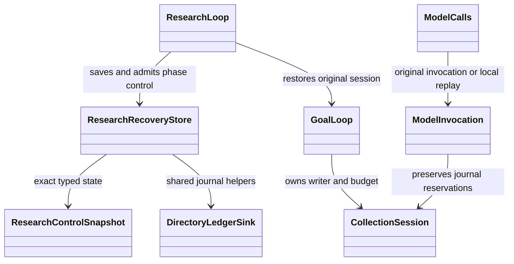

# Interrupted research control storage

`ResearchRecoveryStore` stores a versioned native control snapshot before a
research model phase. It supports `plan`, `assessment`, `answer`, and `review`,
including the initial plan with no completed rounds. Existing
`ghimera.continuation/1` round checkpoints and `checkpoint.json` are unchanged.

The owning recipe supplies the typed, versioned `[research_recovery]` policy;
see `examples/research-recovery.toml`. Research, the original private journal,
model invocation accounting, and bounded retained model results must already
be configured. Storage limits come from the recipe and are pinned in each
snapshot. Restart downtime remains charged to the original run. A caller
cannot enlarge the saved storage allowance by supplying another policy.

## Native API

With the optional policy configured, `ResearchLoop.run` records the control
boundary before each research model call. After a process interruption, read
and preserve the SHA-256 of the owner-private `research-control.json`, then use
the same recipe and pinned collaborators:

```python
result = await research_loop.recover(run_id, snapshot_sha256=original_snapshot_sha256)
```

This continues the existing `_drive` loop at its saved phase. A recovered
assessment skips completed planning, retrieval, discovery and collection;
review recovery also preserves the validated candidate answer. Provider
rotation retains completed round history. Native session restoration acquires
the original journal writer lease and restores model reservations from the
verified tail even when a crash preceded the phase event. Local replay does not
reserve another call. All existing citation, coverage and independent-review
checks still run. Restart downtime counts against the original wall budget.

The lower-level storage API is:

```python
store = ResearchRecoveryStore(config, run_id, recovery_policy)
receipt = store.write(snapshot)
readback = store.read(
    receipt.sha256,
    expected_request=original_research_request,
    expected_models=original_collaborator_identities,
)
```

`ResearchControlSnapshot` carries `request`, partial `progress: ResearchResult`,
`session: SessionState`, admitted hosts, the current phase and round number,
the exact native phase request and pending model input digest/size, the current
plan, assessment, answer/review, assessment context, discovered URLs,
collection stop, prior document/answer sets, and the retained-completion
decision. `progress` carries the original harvest and budget receipt, questions,
completed rounds, model/search identities, retained search observations and
retained-reader report. Source originals and their provenance stay in those
native records. The snapshot records an unsealed run; it cannot claim a finished
answer or contain a stop event.

`write` revalidates the snapshot and requires its ledger to equal the current
intact unsealed journal, with exact run, goal, judge and effective recipe binding.
The pending input digest/size must match the existing native `port_input`
serializer over the saved typed phase request. The file
`<journal.directory>/<run_id>/research-control.json` is staged privately,
fsynced, atomically replaced, and its parent directory fsynced. It reuses the
journal's private-file, path and durability helpers. Existing symlinks,
hard links, public files, foreign ownership, oversized files, torn journals,
and inconsistent invocation accounting are refused. An atomic replacement
failure preserves the prior snapshot and removes the staging file.

`read` requires an expected snapshot SHA-256 and checks the same original
binding. It returns `ResearchRecoveryRead(snapshot, journal, intent_sequence)`;
it performs no append, repair, replay, service request, or source read.

## Adopting an acknowledged return

An empty post-snapshot tail returns `intent_sequence=None`: the saved phase
has no durably recorded invocation. A restart may begin that original phase
only after the owning loop has restored its original budget, state and writer
lease.

A nonempty tail is admitted only when it contains exactly one original native
`model_intent` and returned `model_ack`, optionally followed by the successful
phase event. The intent must have the exact saved phase, model, logical input
scope, input digest and byte count. The acknowledgement must retain the original
`port_output` bytes with its validated digest and size. The output must decode
through the phase's existing native result schema. If present, the phase event
must have the native `model_response:<content_digest>` reason, the exact model
call evidence and planning context, and no other effects.

The returned original `intent_sequence` lets the owning research loop use
native `ModelInvocation.replay` through the phase's owning result schema under
the writer's committed-prefix binding. The loop
restores reservation accounting from the verified journal before replay,
applies its normal plan, source-citation, coverage, answer and independent-review
checks, then continues at the saved control phase. A retained model response
is an observation, not an accepted research conclusion.

Unknown, failed, cancelled, unretained or mismatched returns hold the run for
reconciliation. Extra source/search/graph effects, local replay rows, repeated
model calls, a torn tail or a sealed journal are also refused. Recovery never
invents an acknowledgement or retries an unknown call.

## Operational boundary

The writer is still the journal's existing single owner. Callers must take
snapshots at a quiescent phase boundary while holding its writer lease; the
store checks the journal again before replacement. Independent readers may
inspect the original snapshot without taking a writer lease. Hashes detect
corruption and mismatched evidence; this owner-private mechanism does not
authenticate a malicious owner's rewrite and is not a multi-process database.

This substrate deliberately refuses interruptions with later collection,
retrieval, discovery or graph mutations. Such work needs its own acknowledged
control boundary before it can resume safely. There is no transparent retry of
arbitrary mid-collection work. CLI/service recovery wiring and service/model
acceptance belong to their native owners; storage tests alone do not establish
live recovery or model quality. CLI/service automatic restart wiring remains
separate; the native loop API does not imply that a deployed service invokes it.


