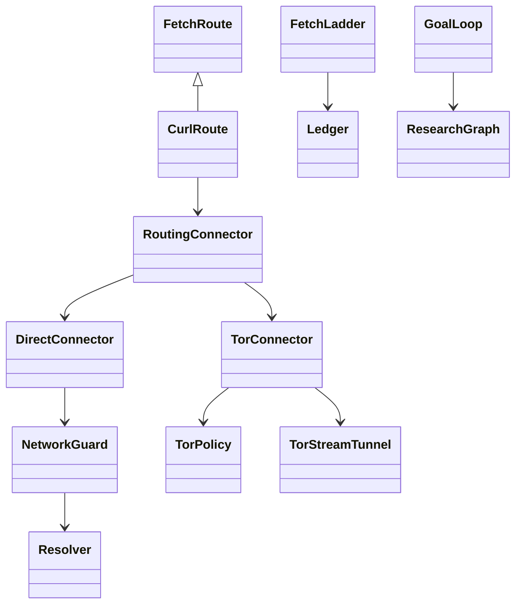

# Native Tor transport — C1 addition

Implemented HTTP capability, not a completed spider or anonymity guarantee.
PRD: TAIPAN `plan/roadmap-050/PRD-chimera-spider.md`, section 4b.

## Operator boundary

`examples/chimera-tor.toml` is a complete, validated example. Supply the approved
local Tor SOCKS endpoint and a short absolute `bridge_directory` on the crawl
host. The example enables Tor for ordinary hosts and onions; a direct-default
configuration can instead select Tor with exact-host `transport.rules` entries.
Onion destinations always require Tor. Both destination-class switches, ports,
connect deadline and redirect-transition policy are explicit inputs. An absent
transport section preserves the earlier direct route for ordinary hosts only.
The package never starts/stops/reconfigures Tor or a host VPN.

Initial implementation supports POSIX Unix sockets and request isolation only.
Other isolation scopes are not accepted as though implemented. The bridge root
must already exist; each request creates a 0700 temporary directory containing a
one-shot socket, never a source-content file. Success, body-limit interruption
and cancellation close the stream, listener and temporary directory. Normal
fetch budgets, spacing, robots and protected-access refusal still apply.

## Enforcement path

`RoutingConnector.prepare` selects the route before any source I/O.
`TorConnector._authenticated_stream` offers **only** SOCKS username/password
authentication; a proxy selecting no authentication refuses. A random
request-specific isolation value is shared by that request's remote lookup and
connection, never persisted or logged. This uses Tor's isolation protocol, not
an account credential. Ordinary hosts use Tor remote RESOLVE, public-address
checking and CONNECT to that checked numeric address. There is no second target
lookup. Valid v3 onions use hostname CONNECT and no ordinary DNS at all.

curl preserves source Host/TLS SNI while opening the private one-shot Unix socket
backed by that authenticated Tor stream. Its own proxy is explicitly disabled,
and it is never given the choice of direct TCP or ambient proxy routing for a
Tor-selected request. TLS verification remains enabled. This also avoids relying
on the bundled curl's unsupported authentication-only SOCKS option. Bounded
request deadlines include remote resolution and stream establishment.

`CurlRoute.validate_redirect` enforces the configured network/route transition;
`FetchLadder._follow` enforces it before requesting the redirect target. Scope
checks still run independently. Invalid v3 encoding/version/checksum, missing
Tor, unavailable Tor and private remote DNS results fail closed. No direct retry.

Successful pages/documents and graph document versions retain non-secret
`chimera.transport-evidence/1` provenance. Fetch ledger failures retain the
**selected** route alongside refusal/status, not a claim that Tor connected.
Graph nodes without transport retain their old canonical /1 representation;
the new field is omitted rather than serialized as a new null field. Request
isolation values and Tor-exit IPs are not graph identity or geography.

## Remaining required work

- Browser networking/subresources, storage isolation and leak acceptance.
- Grounded search adapters using this transport and the complete intent loop.
- Configured bootstrap/health admission and client-version evidence.
- A controlled real onion service, stop-Tor-mid-run and full harvest/citation
  acceptance on the actual admitted laptop/Edge runtime.
- TAIPAN's governed graph/harvest/configuration integration.

No browser, search, model, TAIPAN service or live runtime is activated by this
candidate. A successful public onion read is a native HTTP acceptance point, not
proof of the entire research product or of resistance to traffic analysis.

Protocol references checked 6 October 2026:
[Tor SOCKS extensions](https://spec.torproject.org/socks-extensions.html),
[v3 onion encoding](https://spec.torproject.org/rend-spec/encoding-onion-addresses.html),
[curl Unix sockets](https://curl.se/libcurl/c/CURLOPT_UNIX_SOCKET_PATH.html),
[curl SOCKS authentication](https://curl.se/libcurl/c/CURLOPT_SOCKS5_AUTH.html).
